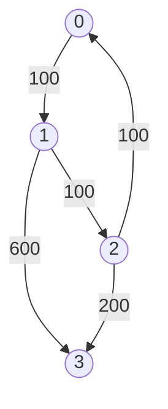

# DP Graph

- [x] [3243. Shortest Distance After Road Addition Queries I](https://leetcode.cn/problems/shortest-distance-after-road-addition-queries-i/) (Medium)
- [x] [787. Cheapest Flights Within K Stops](https://leetcode.cn/problems/cheapest-flights-within-k-stops/) (Medium)
- [ ] [1786. Number of Restricted Paths From First to Last Node](https://leetcode.cn/problems/number-of-restricted-paths-from-first-to-last-node/) (Medium)
- [ ] [2050. Parallel Courses III](https://leetcode.cn/problems/parallel-courses-iii/) (Hard)
- [x] [1976. Number of Ways to Arrive at Destination](https://leetcode.cn/problems/number-of-ways-to-arrive-at-destination/) (Medium)
- [x] [1857. Largest Color Value in a Directed Graph](https://leetcode.cn/problems/largest-color-value-in-a-directed-graph/) (Hard)
- [ ] [1928. Minimum Cost to Reach Destination in Time](https://leetcode.cn/problems/minimum-cost-to-reach-destination-in-time/) (Hard)
- [ ] [913. Cat and Mouse](https://leetcode.cn/problems/cat-and-mouse/) (Hard)
- [ ] [1728. Cat and Mouse II](https://leetcode.cn/problems/cat-and-mouse-ii/) (Hard)
- [ ] [1548. The Most Similar Path in a Graph](https://leetcode.cn/problems/the-most-similar-path-in-a-graph/) (Hard) 👑

## 3243. Shortest Distance After Road Addition Queries I

-   [LeetCode](https://leetcode.com/problems/shortest-distance-after-road-addition-queries-i/) | [LeetCode CH](https://leetcode.cn/problems/shortest-distance-after-road-addition-queries-i/) (Medium)

-   Tags: array, breadth first search, graph
- `n=5`, `queries = [[2,4],[0,2],[0,4]]`
- 
- 
- 
- Output: `[3,2,1]`

```python title="3243. Shortest Distance After Road Addition Queries I - Python Solution"
--8<-- "3243_shortest_distance_after_road_addition_queries_i.py"
```

## 787. Cheapest Flights Within K Stops

-   [LeetCode](https://leetcode.com/problems/cheapest-flights-within-k-stops/) | [LeetCode CH](https://leetcode.cn/problems/cheapest-flights-within-k-stops/) (Medium)

-   Tags: dynamic programming, depth first search, breadth first search, graph, heap priority queue, shortest path
-   Return the cheapest price from `src` to `dst` with at most `K` stops.



<iframe width="560" height="315" src="https://www.youtube.com/embed/5eIK3zUdYmE?si=aBR0VbHXTgNuVlGz" title="YouTube video player" frameborder="0" allow="accelerometer; autoplay; clipboard-write; encrypted-media; gyroscope; picture-in-picture; web-share" referrerpolicy="strict-origin-when-cross-origin" allowfullscreen></iframe>

```python title="787. Cheapest Flights Within K Stops - Python Solution"
--8<-- "0787_cheapest_flights_within_k_stops.py"
```

## 1786. Number of Restricted Paths From First to Last Node

-   [LeetCode](https://leetcode.com/problems/number-of-restricted-paths-from-first-to-last-node/) | [LeetCode CH](https://leetcode.cn/problems/number-of-restricted-paths-from-first-to-last-node/) (Medium)

-   Tags: dynamic programming, graph, topological sort, heap priority queue, shortest path

## 2050. Parallel Courses III

-   [LeetCode](https://leetcode.com/problems/parallel-courses-iii/) | [LeetCode CH](https://leetcode.cn/problems/parallel-courses-iii/) (Hard)

-   Tags: array, dynamic programming, graph, topological sort

## 1976. Number of Ways to Arrive at Destination

-   [LeetCode](https://leetcode.com/problems/number-of-ways-to-arrive-at-destination/) | [LeetCode CH](https://leetcode.cn/problems/number-of-ways-to-arrive-at-destination/) (Medium)

-   Tags: dynamic programming, graph, topological sort, shortest path

```python title="1976. Number of Ways to Arrive at Destination - Python Solution"
--8<-- "1976_number_of_ways_to_arrive_at_destination.py"
```

## 1857. Largest Color Value in a Directed Graph

-   [LeetCode](https://leetcode.com/problems/largest-color-value-in-a-directed-graph/) | [LeetCode CH](https://leetcode.cn/problems/largest-color-value-in-a-directed-graph/) (Hard)

-   Tags: hash table, dynamic programming, graph, topological sort, memoization, counting

```python title="1857. Largest Color Value in a Directed Graph - Python Solution"
--8<-- "1857_largest_color_value_in_a_directed_graph.py"
```

## 1928. Minimum Cost to Reach Destination in Time

-   [LeetCode](https://leetcode.com/problems/minimum-cost-to-reach-destination-in-time/) | [LeetCode CH](https://leetcode.cn/problems/minimum-cost-to-reach-destination-in-time/) (Hard)

-   Tags: array, dynamic programming, graph

## 913. Cat and Mouse

-   [LeetCode](https://leetcode.com/problems/cat-and-mouse/) | [LeetCode CH](https://leetcode.cn/problems/cat-and-mouse/) (Hard)

-   Tags: math, dynamic programming, graph, topological sort, memoization, game theory

## 1728. Cat and Mouse II

-   [LeetCode](https://leetcode.com/problems/cat-and-mouse-ii/) | [LeetCode CH](https://leetcode.cn/problems/cat-and-mouse-ii/) (Hard)

-   Tags: array, math, dynamic programming, graph, topological sort, memoization, matrix, game theory

## 1548. The Most Similar Path in a Graph

-   [LeetCode](https://leetcode.com/problems/the-most-similar-path-in-a-graph/) | [LeetCode CH](https://leetcode.cn/problems/the-most-similar-path-in-a-graph/) (Hard)

-   Tags: dynamic programming, graph
