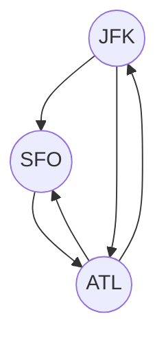

# Eulerian Path and Circuit

## 332. Reconstruct Itinerary

-   [LeetCode](https://leetcode.com/problems/reconstruct-itinerary/) | [LeetCode CH](https://leetcode.cn/problems/reconstruct-itinerary/) (Hard)
-   Tags: depth first search, graph, eulerian circuit
-   Return the itinerary in order that visits every airport exactly once.
-   The starting airport is `JFK`.
-   If there are multiple valid itineraries, return the lexicographically smallest one.
-   Eulerian path: A path that visits every edge exactly once.



```python title="332. Reconstruct Itinerary"
--8<-- "0332_reconstruct_itinerary.py"
```

## 753. Cracking the Safe

-   [LeetCode](https://leetcode.com/problems/cracking-the-safe/) | [LeetCode CH](https://leetcode.cn/problems/cracking-the-safe/) (Hard)
-   Tags: depth first search, graph, eulerian circuit

```python title="753. Cracking the Safe"
--8<-- "0753_cracking_the_safe.py"
```

## 2097. Valid Arrangement of Pairs

-   [LeetCode](https://leetcode.com/problems/valid-arrangement-of-pairs/) | [LeetCode CH](https://leetcode.cn/problems/valid-arrangement-of-pairs/) (Hard)
-   Tags: depth first search, graph, eulerian circuit

```python title="2097. Valid Arrangement of Pairs"
--8<-- "2097_valid_arrangement_of_pairs.py"
```
