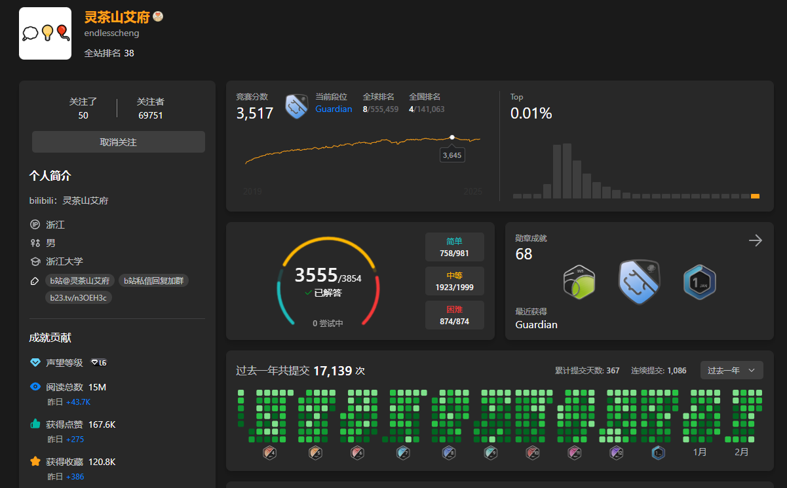

# EndlessCheng 灵茶山艾府

_(As of 2025 February)_

-   [EndlessCheng 灵茶山艾府 - LeetCode](https://leetcode.cn/u/endlesscheng/)
-   题单

    -   [滑动窗口与双指针（定长/不定长/单序列/双序列/三指针）]()
    -   [二分算法（二分答案/最小化最大值/最大化最小值/第 K 小）]()
    -   [单调栈（基础/矩形面积/贡献法/最小字典序）]()
    -   [网格图（DFS/BFS/综合应用）]()
    -   [位运算（基础/性质/拆位/试填/恒等式/思维）]()
    -   [图论算法（DFS/BFS/拓扑排序/最短路/最小生成树/二分图/基环树/欧拉路径）]()
    -   [动态规划（入门/背包/状态机/划分/区间/状压/数位/数据结构优化/树形/博弈/概率期望）](https://leetcode.cn/circle/discuss/tXLS3i/)
    -   [常用数据结构（前缀和/差分/栈/队列/堆/字典树/并查集/树状数组/线段树）](https://leetcode.cn/circle/discuss/mOr1u6/)
    -   [数学算法（数论/组合/概率期望/博弈/计算几何/随机算法）]()
    -   [贪心与思维（基本贪心策略/反悔/区间/字典序/数学/思维/脑筋急转弯/构造）]()
    -   [链表、二叉树与一般树（前后指针/快慢指针/DFS/BFS/直径/LCA）]()
    -   [字符串（KMP/Z 函数/Manacher/字符串哈希/AC 自动机/后缀数组/子序列自动机）]()
