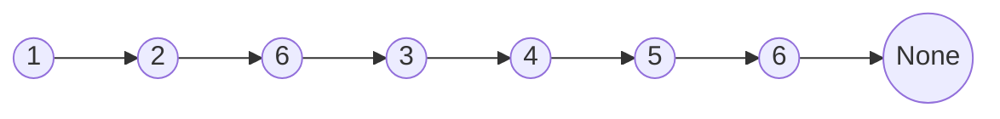
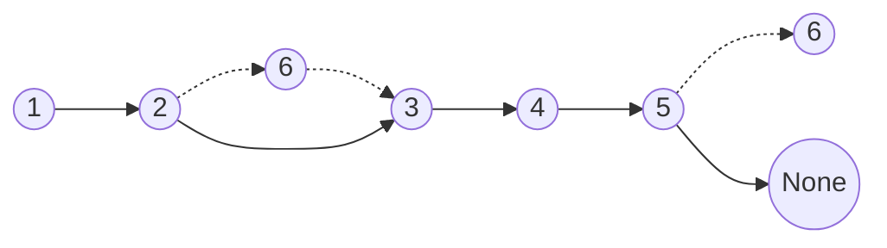

# Linked List Delete Nodes

- [x] [203. Remove Linked List Elements](https://leetcode.cn/problems/remove-linked-list-elements/) (Easy)
- [ ] [3217. Delete Nodes From Linked List Present in Array](https://leetcode.cn/problems/delete-nodes-from-linked-list-present-in-array/) (Medium)
- [ ] [83. Remove Duplicates from Sorted List](https://leetcode.cn/problems/remove-duplicates-from-sorted-list/) (Easy)
- [ ] [82. Remove Duplicates from Sorted List II](https://leetcode.cn/problems/remove-duplicates-from-sorted-list-ii/) (Medium)
- [x] [237. Delete Node in a Linked List](https://leetcode.cn/problems/delete-node-in-a-linked-list/) (Medium)
- [ ] [1669. Merge In Between Linked Lists](https://leetcode.cn/problems/merge-in-between-linked-lists/) (Medium)
- [x] [2487. Remove Nodes From Linked List](https://leetcode.cn/problems/remove-nodes-from-linked-list/) (Medium)
- [ ] [1836. Remove Duplicates From an Unsorted Linked List](https://leetcode.cn/problems/remove-duplicates-from-an-unsorted-linked-list/) (Medium) 👑

## 203. Remove Linked List Elements

-   [LeetCode](https://leetcode.com/problems/remove-linked-list-elements/) | [LeetCode CH](https://leetcode.cn/problems/remove-linked-list-elements/) (Easy)

-   Tags: linked list, recursion
-   Remove all elements from a linked list of integers that have value `val`.

-   Before



-   After



```python title="203. Remove Linked List Elements - Python Solution"
--8<-- "0203_remove_linked_list_elements.py"
```

## 3217. Delete Nodes From Linked List Present in Array

-   [LeetCode](https://leetcode.com/problems/delete-nodes-from-linked-list-present-in-array/) | [LeetCode CH](https://leetcode.cn/problems/delete-nodes-from-linked-list-present-in-array/) (Medium)

-   Tags: array, hash table, linked list

## 83. Remove Duplicates from Sorted List

-   [LeetCode](https://leetcode.com/problems/remove-duplicates-from-sorted-list/) | [LeetCode CH](https://leetcode.cn/problems/remove-duplicates-from-sorted-list/) (Easy)

-   Tags: linked list

## 82. Remove Duplicates from Sorted List II

-   [LeetCode](https://leetcode.com/problems/remove-duplicates-from-sorted-list-ii/) | [LeetCode CH](https://leetcode.cn/problems/remove-duplicates-from-sorted-list-ii/) (Medium)

-   Tags: linked list, two pointers

## 237. Delete Node in a Linked List

-   [LeetCode](https://leetcode.com/problems/delete-node-in-a-linked-list/) | [LeetCode CH](https://leetcode.cn/problems/delete-node-in-a-linked-list/) (Medium)

-   Tags: linked list
-   Delete a node in a singly linked list. You are given only the node to be deleted.

```python title="237. Delete Node in a Linked List - Python Solution"
--8<-- "0237_delete_node_in_a_linked_list.py"
```

## 1669. Merge In Between Linked Lists

-   [LeetCode](https://leetcode.com/problems/merge-in-between-linked-lists/) | [LeetCode CH](https://leetcode.cn/problems/merge-in-between-linked-lists/) (Medium)

-   Tags: linked list

## 2487. Remove Nodes From Linked List

-   [LeetCode](https://leetcode.com/problems/remove-nodes-from-linked-list/) | [LeetCode CH](https://leetcode.cn/problems/remove-nodes-from-linked-list/) (Medium)

-   Tags: linked list, stack, recursion, monotonic stack
-   Remove all nodes from a linked list that have a value greater than `maxValue`.

```python title="2487. Remove Nodes From Linked List - Python Solution"
--8<-- "2487_remove_nodes_from_linked_list.py"
```

## 1836. Remove Duplicates From an Unsorted Linked List

-   [LeetCode](https://leetcode.com/problems/remove-duplicates-from-an-unsorted-linked-list/) | [LeetCode CH](https://leetcode.cn/problems/remove-duplicates-from-an-unsorted-linked-list/) (Medium)

-   Tags: hash table, linked list
