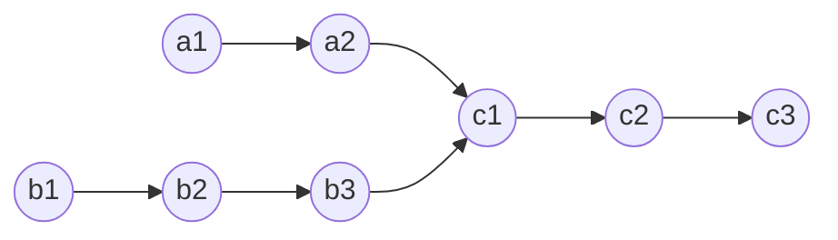

# Linked List Double Pointers

- [ ] [328. Odd Even Linked List](https://leetcode.cn/problems/odd-even-linked-list/) (Medium)
- [ ] [86. Partition List](https://leetcode.cn/problems/partition-list/) (Medium)
- [x] [160. Intersection of Two Linked Lists](https://leetcode.cn/problems/intersection-of-two-linked-lists/) (Easy)

## 328. Odd Even Linked List

-   [LeetCode](https://leetcode.com/problems/odd-even-linked-list/) | [LeetCode CH](https://leetcode.cn/problems/odd-even-linked-list/) (Medium)

-   Tags: linked list

## 86. Partition List

-   [LeetCode](https://leetcode.com/problems/partition-list/) | [LeetCode CH](https://leetcode.cn/problems/partition-list/) (Medium)

-   Tags: linked list, two pointers

## 160. Intersection of Two Linked Lists

-   [LeetCode](https://leetcode.com/problems/intersection-of-two-linked-lists/) | [LeetCode CH](https://leetcode.cn/problems/intersection-of-two-linked-lists/) (Easy)

-   Tags: hash table, linked list, two pointers
-   Find the node at which the intersection of two singly linked lists begins.



```python title="160. Intersection of Two Linked Lists - Python Solution"
--8<-- "0160_intersection_of_two_linked_lists.py"
```
