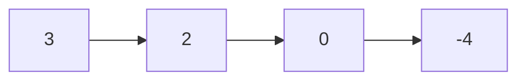
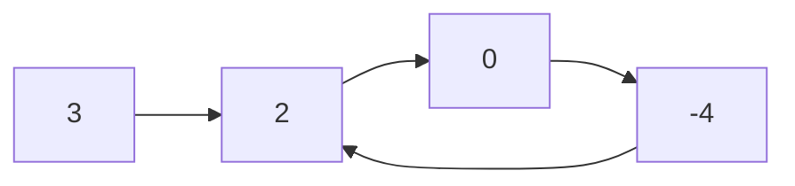

# Linked List Fast Slow Pointers

- [ ] [876. Middle of the Linked List](https://leetcode.cn/problems/middle-of-the-linked-list/) (Easy)
- [ ] [2095. Delete the Middle Node of a Linked List](https://leetcode.cn/problems/delete-the-middle-node-of-a-linked-list/) (Medium)
- [ ] [234. Palindrome Linked List](https://leetcode.cn/problems/palindrome-linked-list/) (Easy)
- [ ] [2130. Maximum Twin Sum of a Linked List](https://leetcode.cn/problems/maximum-twin-sum-of-a-linked-list/) (Medium)
- [x] [143. Reorder List](https://leetcode.cn/problems/reorder-list/) (Medium)
- [x] [141. Linked List Cycle](https://leetcode.cn/problems/linked-list-cycle/) (Easy)
- [x] [142. Linked List Cycle II](https://leetcode.cn/problems/linked-list-cycle-ii/) (Medium)
- [ ] [457. Circular Array Loop](https://leetcode.cn/problems/circular-array-loop/) (Medium)
- [ ] [2674. Split a Circular Linked List](https://leetcode.cn/problems/split-a-circular-linked-list/) (Medium)

## 876. Middle of the Linked List

-   [LeetCode](https://leetcode.com/problems/middle-of-the-linked-list/) | [LeetCode CH](https://leetcode.cn/problems/middle-of-the-linked-list/) (Easy)

-   Tags: linked list, two pointers

## 2095. Delete the Middle Node of a Linked List

-   [LeetCode](https://leetcode.com/problems/delete-the-middle-node-of-a-linked-list/) | [LeetCode CH](https://leetcode.cn/problems/delete-the-middle-node-of-a-linked-list/) (Medium)

-   Tags: linked list, two pointers

## 234. Palindrome Linked List

-   [LeetCode](https://leetcode.com/problems/palindrome-linked-list/) | [LeetCode CH](https://leetcode.cn/problems/palindrome-linked-list/) (Easy)

-   Tags: linked list, two pointers, stack, recursion

## 2130. Maximum Twin Sum of a Linked List

-   [LeetCode](https://leetcode.com/problems/maximum-twin-sum-of-a-linked-list/) | [LeetCode CH](https://leetcode.cn/problems/maximum-twin-sum-of-a-linked-list/) (Medium)

-   Tags: linked list, two pointers, stack

## 143. Reorder List

-   [LeetCode](https://leetcode.com/problems/reorder-list/) | [LeetCode CH](https://leetcode.cn/problems/reorder-list/) (Medium)

-   Tags: linked list, two pointers, stack, recursion

```python title="143. Reorder List - Python Solution"
--8<-- "0143_reorder_list.py"
```

## 141. Linked List Cycle

-   [LeetCode](https://leetcode.com/problems/linked-list-cycle/) | [LeetCode CH](https://leetcode.cn/problems/linked-list-cycle/) (Easy)

-   Tags: hash table, linked list, two pointers
-   Determine if a linked list has a cycle in it.





```python title="141. Linked List Cycle - Python Solution"
--8<-- "0141_linked_list_cycle.py"
```

## 142. Linked List Cycle II

-   [LeetCode](https://leetcode.com/problems/linked-list-cycle-ii/) | [LeetCode CH](https://leetcode.cn/problems/linked-list-cycle-ii/) (Medium)

-   Tags: hash table, linked list, two pointers
-   Given a linked list, return the node where the cycle begins. If there is no cycle, return `None`.


```python title="142. Linked List Cycle II - Python Solution"
--8<-- "0142_linked_list_cycle_ii.py"
```

## 457. Circular Array Loop

-   [LeetCode](https://leetcode.com/problems/circular-array-loop/) | [LeetCode CH](https://leetcode.cn/problems/circular-array-loop/) (Medium)

-   Tags: array, hash table, two pointers

## 2674. Split a Circular Linked List

-   [LeetCode](https://leetcode.com/problems/split-a-circular-linked-list/) | [LeetCode CH](https://leetcode.cn/problems/split-a-circular-linked-list/) (Medium)

-   Tags: linked list, two pointers
