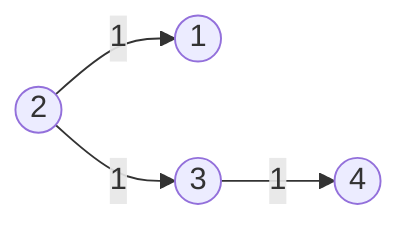
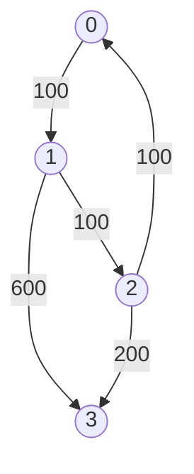

# Shortest Path Single Source Dijkstra

- [x] [743. Network Delay Time](https://leetcode.cn/problems/network-delay-time/) (Medium)
- [ ] [3341. Find Minimum Time to Reach Last Room I](https://leetcode.cn/problems/find-minimum-time-to-reach-last-room-i/) (Medium)
- [ ] [3112. Minimum Time to Visit Disappearing Nodes](https://leetcode.cn/problems/minimum-time-to-visit-disappearing-nodes/) (Medium)
- [ ] [2642. Design Graph With Shortest Path Calculator](https://leetcode.cn/problems/design-graph-with-shortest-path-calculator/) (Hard)
- [x] [1514. Path with Maximum Probability](https://leetcode.cn/problems/path-with-maximum-probability/) (Medium)
- [ ] [3342. Find Minimum Time to Reach Last Room II](https://leetcode.cn/problems/find-minimum-time-to-reach-last-room-ii/) (Medium)
- [x] [1631. Path With Minimum Effort](https://leetcode.cn/problems/path-with-minimum-effort/) (Medium)
- [ ] [1786. Number of Restricted Paths From First to Last Node](https://leetcode.cn/problems/number-of-restricted-paths-from-first-to-last-node/) (Medium)
- [ ] [3123. Find Edges in Shortest Paths](https://leetcode.cn/problems/find-edges-in-shortest-paths/) (Hard)
- [x] [1976. Number of Ways to Arrive at Destination](https://leetcode.cn/problems/number-of-ways-to-arrive-at-destination/) (Medium)
- [x] [778. Swim in Rising Water](https://leetcode.cn/problems/swim-in-rising-water/) (Hard)
- [ ] [2662. Minimum Cost of a Path With Special Roads](https://leetcode.cn/problems/minimum-cost-of-a-path-with-special-roads/) (Medium)
- [ ] [3377. Digit Operations to Make Two Integers Equal](https://leetcode.cn/problems/digit-operations-to-make-two-integers-equal/) (Medium)
- [ ] [2045. Second Minimum Time to Reach Destination](https://leetcode.cn/problems/second-minimum-time-to-reach-destination/) (Hard)
- [ ] [3419. Minimize the Maximum Edge Weight of Graph](https://leetcode.cn/problems/minimize-the-maximum-edge-weight-of-graph/) (Medium)
- [x] [882. Reachable Nodes In Subdivided Graph](https://leetcode.cn/problems/reachable-nodes-in-subdivided-graph/) (Hard)
- [ ] [2203. Minimum Weighted Subgraph With the Required Paths](https://leetcode.cn/problems/minimum-weighted-subgraph-with-the-required-paths/) (Hard)
- [ ] [2577. Minimum Time to Visit a Cell In a Grid](https://leetcode.cn/problems/minimum-time-to-visit-a-cell-in-a-grid/) (Hard)
- [ ] [1928. Minimum Cost to Reach Destination in Time](https://leetcode.cn/problems/minimum-cost-to-reach-destination-in-time/) (Hard)
- [x] [787. Cheapest Flights Within K Stops](https://leetcode.cn/problems/cheapest-flights-within-k-stops/) (Medium)
- [ ] [2699. Modify Graph Edge Weights](https://leetcode.cn/problems/modify-graph-edge-weights/) (Hard)
- [ ] [1810. Minimum Path Cost in a Hidden Grid](https://leetcode.cn/problems/minimum-path-cost-in-a-hidden-grid/) (Medium)
- [ ] [2093. Minimum Cost to Reach City With Discounts](https://leetcode.cn/problems/minimum-cost-to-reach-city-with-discounts/) (Medium)
- [ ] [2473. Minimum Cost to Buy Apples](https://leetcode.cn/problems/minimum-cost-to-buy-apples/) (Medium)
- [ ] [2714. Find Shortest Path with K Hops](https://leetcode.cn/problems/find-shortest-path-with-k-hops/) (Hard)
- [ ] [2737. Find the Closest Marked Node](https://leetcode.cn/problems/find-the-closest-marked-node/) (Medium)

## 743. Network Delay Time

-   [LeetCode](https://leetcode.com/problems/network-delay-time/) | [LeetCode CH](https://leetcode.cn/problems/network-delay-time/) (Medium)
-   Tags: depth first search, breadth first search, graph, heap priority queue, shortest path
-   Return the minimum time taken to reach all nodes in a network.



-   Shortest Path Problem: Find the shortest path between two vertices in a graph.
-   Dijkstra's Algorithm
    -   Shortest path algorithm
    -   Weighted graph (non-negative weights)
    -   Data Structure: Heap; Hash Set
    -   Time Complexity: O(E \* logV)
    -   Space Complexity: O(V)

```python title="743. Network Delay Time"
--8<-- "0743_network_delay_time.py"
```

## 3341. Find Minimum Time to Reach Last Room I

-   [LeetCode](https://leetcode.com/problems/find-minimum-time-to-reach-last-room-i/) | [LeetCode CH](https://leetcode.cn/problems/find-minimum-time-to-reach-last-room-i/) (Medium)
-   Tags: array, graph, heap priority queue, matrix, shortest path

## 3112. Minimum Time to Visit Disappearing Nodes

-   [LeetCode](https://leetcode.com/problems/minimum-time-to-visit-disappearing-nodes/) | [LeetCode CH](https://leetcode.cn/problems/minimum-time-to-visit-disappearing-nodes/) (Medium)
-   Tags: array, graph, heap priority queue, shortest path

## 2642. Design Graph With Shortest Path Calculator

-   [LeetCode](https://leetcode.com/problems/design-graph-with-shortest-path-calculator/) | [LeetCode CH](https://leetcode.cn/problems/design-graph-with-shortest-path-calculator/) (Hard)
-   Tags: graph, design, heap priority queue, shortest path

## 1514. Path with Maximum Probability

-   [LeetCode](https://leetcode.com/problems/path-with-maximum-probability/) | [LeetCode CH](https://leetcode.cn/problems/path-with-maximum-probability/) (Medium)
-   Tags: array, graph, heap priority queue, shortest path

```python title="1514. Path with Maximum Probability"
--8<-- "1514_path_with_maximum_probability.py"
```

## 3342. Find Minimum Time to Reach Last Room II

-   [LeetCode](https://leetcode.com/problems/find-minimum-time-to-reach-last-room-ii/) | [LeetCode CH](https://leetcode.cn/problems/find-minimum-time-to-reach-last-room-ii/) (Medium)
-   Tags: array, graph, heap priority queue, matrix, shortest path

## 1631. Path With Minimum Effort

-   [LeetCode](https://leetcode.com/problems/path-with-minimum-effort/) | [LeetCode CH](https://leetcode.cn/problems/path-with-minimum-effort/) (Medium)
-   Tags: array, binary search, depth first search, breadth first search, union find, heap priority queue, matrix
-   Return the minimum effort required to travel from the top-left to the bottom-right corner.

```python title="1631. Path With Minimum Effort"
--8<-- "1631_path_with_minimum_effort.py"
```

## 1786. Number of Restricted Paths From First to Last Node

-   [LeetCode](https://leetcode.com/problems/number-of-restricted-paths-from-first-to-last-node/) | [LeetCode CH](https://leetcode.cn/problems/number-of-restricted-paths-from-first-to-last-node/) (Medium)
-   Tags: dynamic programming, graph, topological sort, heap priority queue, shortest path

## 3123. Find Edges in Shortest Paths

-   [LeetCode](https://leetcode.com/problems/find-edges-in-shortest-paths/) | [LeetCode CH](https://leetcode.cn/problems/find-edges-in-shortest-paths/) (Hard)
-   Tags: depth first search, breadth first search, graph, heap priority queue, shortest path

## 1976. Number of Ways to Arrive at Destination

-   [LeetCode](https://leetcode.com/problems/number-of-ways-to-arrive-at-destination/) | [LeetCode CH](https://leetcode.cn/problems/number-of-ways-to-arrive-at-destination/) (Medium)
-   Tags: dynamic programming, graph, topological sort, shortest path

```python title="1976. Number of Ways to Arrive at Destination"
--8<-- "1976_number_of_ways_to_arrive_at_destination.py"
```

## 778. Swim in Rising Water

-   [LeetCode](https://leetcode.com/problems/swim-in-rising-water/) | [LeetCode CH](https://leetcode.cn/problems/swim-in-rising-water/) (Hard)
-   Tags: array, binary search, depth first search, breadth first search, union find, heap priority queue, matrix
-   Return the minimum time when you can reach the target.


```python title="778. Swim in Rising Water"
--8<-- "0778_swim_in_rising_water.py"
```

## 2662. Minimum Cost of a Path With Special Roads

-   [LeetCode](https://leetcode.com/problems/minimum-cost-of-a-path-with-special-roads/) | [LeetCode CH](https://leetcode.cn/problems/minimum-cost-of-a-path-with-special-roads/) (Medium)
-   Tags: array, graph, heap priority queue, shortest path

## 3377. Digit Operations to Make Two Integers Equal

-   [LeetCode](https://leetcode.com/problems/digit-operations-to-make-two-integers-equal/) | [LeetCode CH](https://leetcode.cn/problems/digit-operations-to-make-two-integers-equal/) (Medium)
-   Tags: math, graph, heap priority queue, number theory, shortest path

## 2045. Second Minimum Time to Reach Destination

-   [LeetCode](https://leetcode.com/problems/second-minimum-time-to-reach-destination/) | [LeetCode CH](https://leetcode.cn/problems/second-minimum-time-to-reach-destination/) (Hard)
-   Tags: breadth first search, graph, shortest path

## 3419. Minimize the Maximum Edge Weight of Graph

-   [LeetCode](https://leetcode.com/problems/minimize-the-maximum-edge-weight-of-graph/) | [LeetCode CH](https://leetcode.cn/problems/minimize-the-maximum-edge-weight-of-graph/) (Medium)
-   Tags: binary search, depth first search, breadth first search, graph, shortest path

## 882. Reachable Nodes In Subdivided Graph

-   [LeetCode](https://leetcode.com/problems/reachable-nodes-in-subdivided-graph/) | [LeetCode CH](https://leetcode.cn/problems/reachable-nodes-in-subdivided-graph/) (Hard)
-   Tags: graph, heap priority queue, shortest path

```python title="882. Reachable Nodes In Subdivided Graph"
--8<-- "0882_reachable_nodes_in_subdivided_graph.py"
```

## 2203. Minimum Weighted Subgraph With the Required Paths

-   [LeetCode](https://leetcode.com/problems/minimum-weighted-subgraph-with-the-required-paths/) | [LeetCode CH](https://leetcode.cn/problems/minimum-weighted-subgraph-with-the-required-paths/) (Hard)
-   Tags: graph, shortest path

## 2577. Minimum Time to Visit a Cell In a Grid

-   [LeetCode](https://leetcode.com/problems/minimum-time-to-visit-a-cell-in-a-grid/) | [LeetCode CH](https://leetcode.cn/problems/minimum-time-to-visit-a-cell-in-a-grid/) (Hard)
-   Tags: array, breadth first search, graph, heap priority queue, matrix, shortest path

## 1928. Minimum Cost to Reach Destination in Time

-   [LeetCode](https://leetcode.com/problems/minimum-cost-to-reach-destination-in-time/) | [LeetCode CH](https://leetcode.cn/problems/minimum-cost-to-reach-destination-in-time/) (Hard)
-   Tags: array, dynamic programming, graph

## 787. Cheapest Flights Within K Stops

-   [LeetCode](https://leetcode.com/problems/cheapest-flights-within-k-stops/) | [LeetCode CH](https://leetcode.cn/problems/cheapest-flights-within-k-stops/) (Medium)
-   Tags: dynamic programming, depth first search, breadth first search, graph, heap priority queue, shortest path
-   Return the cheapest price from `src` to `dst` with at most `K` stops.



<iframe width="560" height="315" src="https://www.youtube.com/embed/5eIK3zUdYmE?si=aBR0VbHXTgNuVlGz" title="YouTube video player" frameborder="0" allow="accelerometer; autoplay; clipboard-write; encrypted-media; gyroscope; picture-in-picture; web-share" referrerpolicy="strict-origin-when-cross-origin" allowfullscreen></iframe>

```python title="787. Cheapest Flights Within K Stops"
--8<-- "0787_cheapest_flights_within_k_stops.py"
```

## 2699. Modify Graph Edge Weights

-   [LeetCode](https://leetcode.com/problems/modify-graph-edge-weights/) | [LeetCode CH](https://leetcode.cn/problems/modify-graph-edge-weights/) (Hard)
-   Tags: graph, heap priority queue, shortest path

## 1810. Minimum Path Cost in a Hidden Grid

-   [LeetCode](https://leetcode.com/problems/minimum-path-cost-in-a-hidden-grid/) | [LeetCode CH](https://leetcode.cn/problems/minimum-path-cost-in-a-hidden-grid/) (Medium)
-   Tags: depth first search, breadth first search, graph, heap priority queue, interactive

## 2093. Minimum Cost to Reach City With Discounts

-   [LeetCode](https://leetcode.com/problems/minimum-cost-to-reach-city-with-discounts/) | [LeetCode CH](https://leetcode.cn/problems/minimum-cost-to-reach-city-with-discounts/) (Medium)
-   Tags: graph, heap priority queue, shortest path

## 2473. Minimum Cost to Buy Apples

-   [LeetCode](https://leetcode.com/problems/minimum-cost-to-buy-apples/) | [LeetCode CH](https://leetcode.cn/problems/minimum-cost-to-buy-apples/) (Medium)
-   Tags: array, graph, heap priority queue, shortest path

## 2714. Find Shortest Path with K Hops

-   [LeetCode](https://leetcode.com/problems/find-shortest-path-with-k-hops/) | [LeetCode CH](https://leetcode.cn/problems/find-shortest-path-with-k-hops/) (Hard)
-   Tags: graph, heap priority queue, shortest path

## 2737. Find the Closest Marked Node

-   [LeetCode](https://leetcode.com/problems/find-the-closest-marked-node/) | [LeetCode CH](https://leetcode.cn/problems/find-the-closest-marked-node/) (Medium)
-   Tags: array, graph, heap priority queue, shortest path
