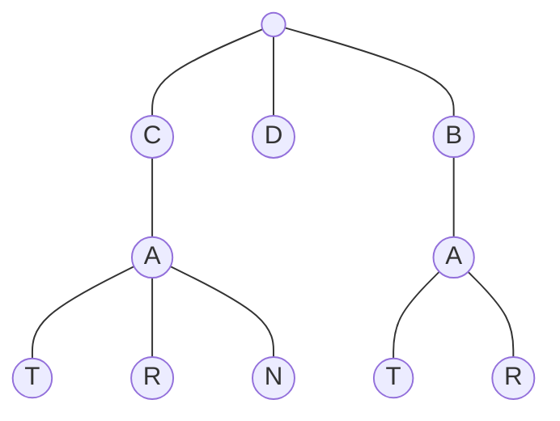

# Trie Basics

- [x] [208. Implement Trie (Prefix Tree)](https://leetcode.cn/problems/implement-trie-prefix-tree/) (Medium)
- [x] [211. Design Add and Search Words Data Structure](https://leetcode.cn/problems/design-add-and-search-words-data-structure/) (Medium)
- [x] [14. Longest Common Prefix](https://leetcode.cn/problems/longest-common-prefix/) (Easy)
- [ ] [648. Replace Words](https://leetcode.cn/problems/replace-words/) (Medium)
- [ ] [677. Map Sum Pairs](https://leetcode.cn/problems/map-sum-pairs/) (Medium)
- [ ] [720. Longest Word in Dictionary](https://leetcode.cn/problems/longest-word-in-dictionary/) (Medium)
- [ ] [1268. Search Suggestions System](https://leetcode.cn/problems/search-suggestions-system/) (Medium)
- [ ] [1233. Remove Sub-Folders from the Filesystem](https://leetcode.cn/problems/remove-sub-folders-from-the-filesystem/) (Medium)
- [ ] [820. Short Encoding of Words](https://leetcode.cn/problems/short-encoding-of-words/) (Medium)
- [ ] [2416. Sum of Prefix Scores of Strings](https://leetcode.cn/problems/sum-of-prefix-scores-of-strings/) (Hard)
- [ ] [2261. K Divisible Elements Subarrays](https://leetcode.cn/problems/k-divisible-elements-subarrays/) (Medium)
- [ ] [1804. Implement Trie II (Prefix Tree)](https://leetcode.cn/problems/implement-trie-ii-prefix-tree/) (Medium)
- [ ] [2168. Unique Substrings With Equal Digit Frequency](https://leetcode.cn/problems/unique-substrings-with-equal-digit-frequency/) (Medium)

## 208. Implement Trie (Prefix Tree)

-   [LeetCode](https://leetcode.com/problems/implement-trie-prefix-tree/) | [LeetCode CH](https://leetcode.cn/problems/implement-trie-prefix-tree/) (Medium)

-   Tags: hash table, string, design, trie
## Trie

-   A trie is a tree-like data structure whose nodes store the letters of an alphabet.



```python title="208. Implement Trie (Prefix Tree) - Python Solution"
--8<-- "0208_implement_trie_prefix_tree.py"
```

## 211. Design Add and Search Words Data Structure

-   [LeetCode](https://leetcode.com/problems/design-add-and-search-words-data-structure/) | [LeetCode CH](https://leetcode.cn/problems/design-add-and-search-words-data-structure/) (Medium)

-   Tags: string, depth first search, design, trie

```python title="211. Design Add and Search Words Data Structure - Python Solution"
--8<-- "0211_design_add_and_search_words_data_structure.py"
```

## 14. Longest Common Prefix

-   [LeetCode](https://leetcode.com/problems/longest-common-prefix/) | [LeetCode CH](https://leetcode.cn/problems/longest-common-prefix/) (Easy)

-   Tags: string, trie

```python title="14. Longest Common Prefix - Python Solution"
--8<-- "0014_longest_common_prefix.py"
```

## 648. Replace Words

-   [LeetCode](https://leetcode.com/problems/replace-words/) | [LeetCode CH](https://leetcode.cn/problems/replace-words/) (Medium)

-   Tags: array, hash table, string, trie

## 677. Map Sum Pairs

-   [LeetCode](https://leetcode.com/problems/map-sum-pairs/) | [LeetCode CH](https://leetcode.cn/problems/map-sum-pairs/) (Medium)

-   Tags: hash table, string, design, trie

## 720. Longest Word in Dictionary

-   [LeetCode](https://leetcode.com/problems/longest-word-in-dictionary/) | [LeetCode CH](https://leetcode.cn/problems/longest-word-in-dictionary/) (Medium)

-   Tags: array, hash table, string, trie, sorting

## 1268. Search Suggestions System

-   [LeetCode](https://leetcode.com/problems/search-suggestions-system/) | [LeetCode CH](https://leetcode.cn/problems/search-suggestions-system/) (Medium)

-   Tags: array, string, binary search, trie, sorting, heap priority queue

## 1233. Remove Sub-Folders from the Filesystem

-   [LeetCode](https://leetcode.com/problems/remove-sub-folders-from-the-filesystem/) | [LeetCode CH](https://leetcode.cn/problems/remove-sub-folders-from-the-filesystem/) (Medium)

-   Tags: array, string, depth first search, trie

## 820. Short Encoding of Words

-   [LeetCode](https://leetcode.com/problems/short-encoding-of-words/) | [LeetCode CH](https://leetcode.cn/problems/short-encoding-of-words/) (Medium)

-   Tags: array, hash table, string, trie

## 2416. Sum of Prefix Scores of Strings

-   [LeetCode](https://leetcode.com/problems/sum-of-prefix-scores-of-strings/) | [LeetCode CH](https://leetcode.cn/problems/sum-of-prefix-scores-of-strings/) (Hard)

-   Tags: array, string, trie, counting

## 2261. K Divisible Elements Subarrays

-   [LeetCode](https://leetcode.com/problems/k-divisible-elements-subarrays/) | [LeetCode CH](https://leetcode.cn/problems/k-divisible-elements-subarrays/) (Medium)

-   Tags: array, hash table, trie, rolling hash, hash function, enumeration

## 1804. Implement Trie II (Prefix Tree)

-   [LeetCode](https://leetcode.com/problems/implement-trie-ii-prefix-tree/) | [LeetCode CH](https://leetcode.cn/problems/implement-trie-ii-prefix-tree/) (Medium)

-   Tags: hash table, string, design, trie

## 2168. Unique Substrings With Equal Digit Frequency

-   [LeetCode](https://leetcode.com/problems/unique-substrings-with-equal-digit-frequency/) | [LeetCode CH](https://leetcode.cn/problems/unique-substrings-with-equal-digit-frequency/) (Medium)

-   Tags: hash table, string, rolling hash, counting, hash function
