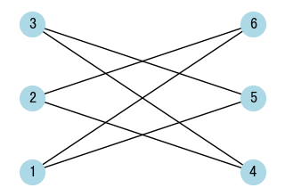

# Graph - Coloring

## Bipartite Graph



How to group

|          | Uncolored | Color 1 | Color 2 | Operation   |
| -------- | --------- | ------- | ------- | ----------- |
| Method 1 | -1        | 0       | 1       | `1 - color` |
| Method 2 | 0         | 1       | -1      | `-color`    |

## LeetCode Problems

1. 0785 - [Is Graph Bipartite?](https://leetcode.com/problems/is-graph-bipartite/) (Medium)
2. 886 - [Possible Bipartition](https://leetcode.com/problems/possible-bipartition/) (Medium)

## 785. Is Graph Bipartite?

- Determine if a graph is bipartite.

```python
--8<-- "0785_is_graph_bipartite.py"
```

## 886. Possible Bipartition

- Determine if a graph can be divided into two groups such that no two nodes of the same group are connected.

```python
--8<-- "0886_possible_bipartition.py"
```
