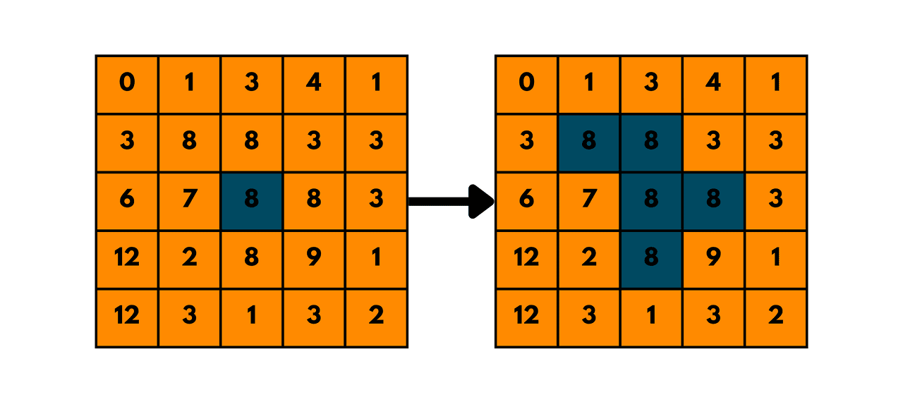
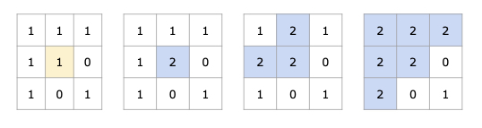
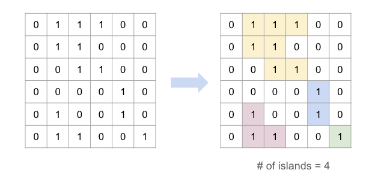

# Graph - Flood Fill

-   **Flood Fill** is essentially a graph traversal algorithm (like BFS or DFS) applied to matrices (2D grids).
    It checks adjacent cells (up, down, left, right) of a starting point to determine whether they belong to the same region.
    Typically, it involves modifying or marking the cells that belong to the same connected component.

{width=300px}

## LeetCode Problems

1. 0733 - [Flood Fill](https://leetcode.com/problems/flood-fill/) | [图像渲染](https://leetcode.cn/problems/flood-fill/) (Easy)
2. 0200 - [Number of Islands](https://leetcode.com/problems/number-of-islands/) | [岛屿数量](https://leetcode.cn/problems/number-of-islands/) (Medium)
3. 0695 - [Max Area of Island](https://leetcode.com/problems/max-area-of-island/) | [岛屿的最大面积](https://leetcode.cn/problems/max-area-of-island/) (Medium)
4. 0463 - [Island Perimeter](https://leetcode.com/problems/island-perimeter/) | [岛屿的周长](https://leetcode.cn/problems/island-perimeter/) (Easy)
5. 0130 - [Surrounded Regions](https://leetcode.com/problems/surrounded-regions/) | [被围绕的区域](https://leetcode.cn/problems/surrounded-regions/) (Medium)
6. 0417 - [Pacific Atlantic Water Flow](https://leetcode.com/problems/pacific-atlantic-water-flow/) | [太平洋大西洋水流问题](https://leetcode.cn/problems/pacific-atlantic-water-flow/) (Medium)
7. 0827 - [Making A Large Island](https://leetcode.com/problems/making-a-large-island/) | [最大人工岛](https://leetcode.cn/problems/making-a-large-island/) (Hard)

## 733. Flood Fill

-   Replace all the pixels of the same color starting from the given pixel.
-   In other words, find the connected component of the starting pixel and change the color of all the pixels in that component.
-   Edge cases: If the starting pixel is already the target color, return the image as it is.



```python
--8<-- "0733_flood_fill.py"
```

## 200. Number of Islands

-   Count the number of islands in a 2D grid.
-   Method 1: DFS
-   Method 2: BFS (use a queue to traverse the grid)

-   How to keep track of visited cells?

    1. Mark the visited cell as `0` (or any other value) to avoid revisiting it.
    2. Use a set to store the visited cells.

-   Steps:
    1. Init: variables
    2. DFS/BFS: starting from the cell with `1`, turn all the connected `1`s to `0`.
    3. Traverse the grid, and if the cell is `1`, increment the count and call DFS/BFS.



```python
--8<-- "0200_number_of_islands.py"
```

## 695. Max Area of Island

-   Find the maximum area of an island in a 2D grid.

{width=300px}

```python
--8<-- "0695_max_area_of_island.py"
```

## 463. Island Perimeter

-   Calculate the perimeter of an island in a 2D grid.

{width=300px}

```python
--8<-- "0463_island_perimeter.py"
```

## 130. Surrounded Regions

-   Replace all the 'O's with 'X's if surrounded by 'X's.

```python
--8<-- "0130_surrounded_regions.py"
```

## 417. Pacific Atlantic Water Flow

-   Find the list of coordinates where water can flow to both the Pacific and Atlantic oceans.

{width=300px}

```python
--8<-- "0417_pacific_atlantic_water_flow.py"
```

## 827. Making A Large Island

-   Find the area of the largest island after changing at most one '0' to '1'.

```python
--8<-- "0827_making_a_large_island.py"
```
