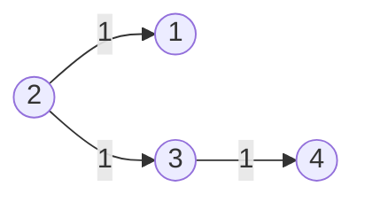

# Graph - Shortest Path Problems

- Shortest Path Problem: Find the shortest path between two vertices in a graph.

## Dijkstra's Algorithm

- Shortest path algorithm
- Weighted graph (non-negative weights)
- Data Structure: Heap; HashSet
- Time Complexity: $O(E \cdot \log{V})$
- Space Complexity: $O(V)$

## LeetCode Problems

1. 0743 - [Network Delay Time](https://leetcode.com/problems/network-delay-time/) (Medium)
2. 0778 - [Swim in Rising Water](https://leetcode.com/problems/swim-in-rising-water/) (Hard)
3. 1631 - [Path With Minimum Effort](https://leetcode.com/problems/path-with-minimum-effort/) (Medium)
4. 0787 - [Cheapest Flights Within K Stops](https://leetcode.com/problems/cheapest-flights-within-k-stops/) (Medium)
5. 1514 - [Path with Maximum Probability](https://leetcode.com/problems/path-with-maximum-probability/) (Medium)
6. 0505 - [The Maze II](https://leetcode.com/problems/the-maze-ii/) (Medium)
7. 0499 - [The Maze III](https://leetcode.com/problems/the-maze-iii/) (Hard)
8. 0882 - [Reachable Nodes In Subdivided Graph](https://leetcode.com/problems/reachable-nodes-in-subdivided-graph/) (Hard)
9. 1376 - [Time Needed to Inform All Employees](https://leetcode.com/problems/time-needed-to-inform-all-employees/) (Medium)
10. 1168 - [Optimize Water Distribution in a Village](https://leetcode.com/problems/optimize-water-distribution-in-a-village/) (Hard)
11. 1976 - [Number of Ways to Arrive at Destination](https://leetcode.com/problems/number-of-ways-to-arrive-at-destination/) (Hard)

## 743. Network Delay Time

- Return the minimum time taken to reach all nodes in a network.



```python
--8<-- "0743_network_delay_time.py"
```

## 778. Swim in Rising Water

- Return the minimum time when you can reach the target.


```python
--8<-- "0778_swim_in_rising_water.py"
```

## 1631. Path With Minimum Effort

- Return the minimum effort required to travel from the top-left to the bottom-right corner.

```python
--8<-- "1631_path_with_minimum_effort.py"
```

## 787. Cheapest Flights Within K Stops

```python
--8<-- "0787_cheapest_flights_within_k_stops.py"
```

## 1514. Path with Maximum Probability

```python
--8<-- "1514_path_with_maximum_probability.py"
```

## 505. The Maze II

```python
--8<-- "0505_the_maze_ii.py"
```

## 499. The Maze III

```python
--8<-- "0499_the_maze_iii.py"
```

## 882. Reachable Nodes In Subdivided Graph

```python
--8<-- "0882_reachable_nodes_in_subdivided_graph.py"
```

## 1376. Time Needed to Inform All Employees

```python
--8<-- "1376_time_needed_to_inform_all_employees.py"
```

## 1168. Optimize Water Distribution in a Village


```python
--8<-- "1168_optimize_water_distribution_in_a_village.py"
```

## 1976. Number of Ways to Arrive at Destination

```python
--8<-- "1976_number_of_ways_to_arrive_at_destination.py"
```

## Appendix

```python
--8<-- "template/graph_shortest_path.py"
```
