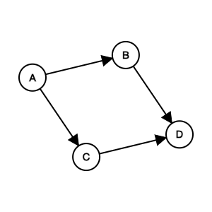
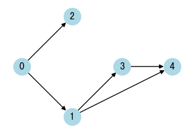
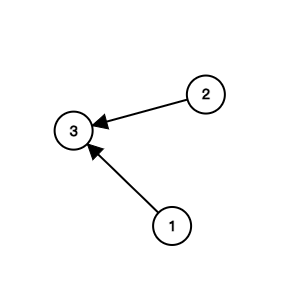

# Graph - Topological Sort

## Topological Sort

- DAG (Directed Acyclic Graph)
- Time complexity: $O(V+E)$
- Space complexity: $O(V+E)$
- prerequisites
    - Indegree (Look at the problem [1557. Minimum Number of Vertices to Reach All Nodes](https://leetcode.com/problems/minimum-number-of-vertices-to-reach-all-nodes/))

```python
--8<-- "template/graph_topological_sort.py"
```

{width=300px}

{width=300px}

## LeetCode Problems

1. 1557 - [Minimum Number of Vertices to Reach All Nodes](https://leetcode.com/problems/minimum-number-of-vertices-to-reach-all-nodes/) (Medium)
2. 0207 - [Course Schedule](https://leetcode.com/problems/course-schedule/) (Medium)
3. 0210 - [Course Schedule II](https://leetcode.com/problems/course-schedule-ii/) (Medium)
4. 0269 - [Alien Dictionary](https://leetcode.com/problems/alien-dictionary/) (Hard)
5. 1203 - [Sort Items by Groups Respecting Dependencies](https://leetcode.com/problems/sort-items-by-groups-respecting-dependencies/) (Hard)
6. 1857 - [Largest Color Value in a Directed Graph](https://leetcode.com/problems/largest-color-value-in-a-directed-graph/) (Hard)
7. 1136 - [Parallel Courses](https://leetcode.com/problems/parallel-courses/) (Hard)

## 1557. Minimum Number of Vertices to Reach All Nodes

- Return a list of integers representing the minimum number of vertices needed to traverse all the nodes.

```python
--8<-- "1557_minimum_number_of_vertices_to_reach_all_nodes.py"
```

## 207. Course Schedule

- Return true if it is possible to finish all courses, otherwise return false.



```python
--8<-- "0207_course_schedule.py"
```

## 210. Course Schedule II

- Return the ordering of courses you should take to finish all courses. If there are multiple valid answers, return any of them.


```python
--8<-- "0210_course_schedule_ii.py"
```

## 269. Alien Dictionary

- Return the correct order of characters in the alien language.

```python
--8<-- "0269_alien_dictionary.py"
```

## 1203. Sort Items by Groups Respecting Dependencies

- Return any permutation of the items that satisfies the requirements.

```python
--8<-- "1203_sort_items_by_groups_respecting_dependencies.py"
```

## 1857. Largest Color Value in a Directed Graph

- Return the largest color value of any node in the graph.

```python
--8<-- "1857_largest_color_value_in_a_directed_graph.py"
```

## 1136. Parallel Courses

- Return the minimum number of semesters needed to take all courses.

{width=300px}

```python
--8<-- "1136_parallel_courses.py"
```
