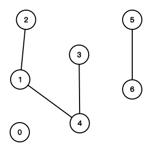

# Union Find (Disjoint Set)

## Union Find

1. Path Compression
2. Union by Rank

```python
--8<-- "template/union_find.py"
```

{width=300px}

## LeetCode Problems

1. 0547 - [Number of Provinces](https://leetcode.com/problems/number-of-provinces/) (Medium)
2. 0684 - [Redundant Connection](https://leetcode.com/problems/redundant-connection/) (Medium)
3. 0323 - [Number of Connected Components in an Undirected Graph](https://leetcode.com/problems/number-of-connected-components-in-an-undirected-graph/) (Medium)
4. 0721 - [Accounts Merge](https://leetcode.com/problems/accounts-merge/) (Medium)
5. 0990 - [Satisfiability of Equality Equations](https://leetcode.com/problems/satisfiability-of-equality-equations/) (Medium)
6. 0952 - [Largest Component Size by Common Factor](https://leetcode.com/problems/largest-component-size-by-common-factor/) (Hard)
7. 0839 - [Similar String Groups](https://leetcode.com/problems/similar-string-groups/) (Hard)
8. 0305 - [Number of Islands II](https://leetcode.com/problems/number-of-islands-ii/) (Hard)
9. 1202 - [Smallest String With Swaps](https://leetcode.com/problems/smallest-string-with-swaps/) (Medium)
10. 0685 - [Redundant Connection II](https://leetcode.com/problems/redundant-connection-ii/) (Hard)
11. 0399 - [Evaluate Division](https://leetcode.com/problems/evaluate-division/) (Medium)

## 547. Number of Provinces

```python
--8<-- "0547_number_of_provinces.py"
```

## 684. Redundant Connection

```python
--8<-- "0684_redundant_connection.py"
```

## 323. Number of Connected Components in an Undirected Graph

```python
--8<-- "0323_number_of_connected_components_in_an_undirected_graph.py"
```

## 721. Accounts Merge

```python
--8<-- "0721_accounts_merge.py"
```

## 990. Satisfiability of Equality Equations

```python
--8<-- "0990_satisfiability_of_equality_equations.py"
```

## 952. Largest Component Size by Common Factor

```python
--8<-- "0952_largest_component_size_by_common_factor.py"
```

## 839. Similar String Groups

```python
--8<-- "0839_similar_string_groups.py"
```

## 305. Number of Islands II

```python
--8<-- "0305_number_of_islands_ii.py"
```

## 1202. Smallest String With Swaps

```python
--8<-- "1202_smallest_string_with_swaps.py"
```

## 685. Redundant Connection II

```python
--8<-- "0685_redundant_connection_ii.py"
```

## 399. Evaluate Division

```python
--8<-- "0399_evaluate_division.py"
```
