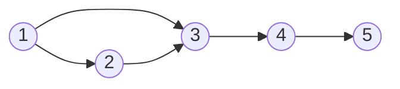
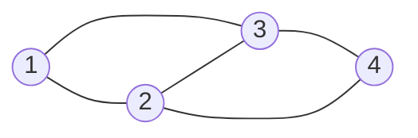
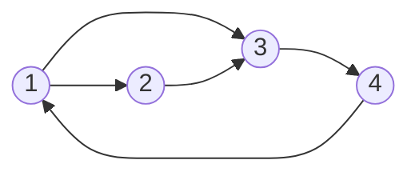
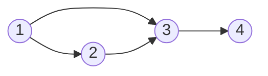
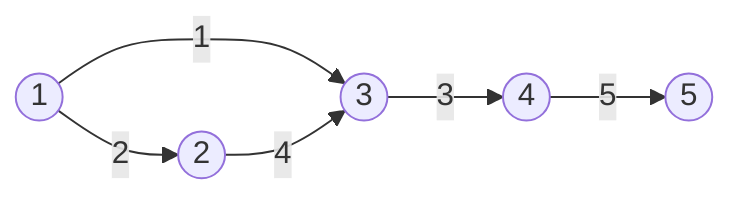
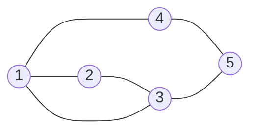

# Graph

Undirected graph

```mermaid
flowchart LR
1((1))
2((2))
3((3))
4((4))
5((5))
1 --> 3
1 --> 2
3 --> 4
2 --> 3
4 --> 5
```

Directed graph

```mermaid
flowchart LR
1((1))
2((2))
3((3))
4((4))
1 --- 3
1 --- 2
3 --- 4
2 --- 3
2 --- 4
```

Cyclic graph

```mermaid
flowchart LR
1((1))
2((2))
3((3))
4((4))
1 --> 3
1 --> 2
3 --> 4
2 --> 3
4 --> 1
```

Acyclic graph

```mermaid
flowchart LR
1((1))
2((2))
3((3))
4((4))
1 --> 3
1 --> 2
3 --> 4
2 --> 3
```

Directed Acyclic Graph (DAG)

```mermaid
flowchart LR
1((1))
2((2))
3((3))
4((4))
1 --> 3
1 --> 2
3 --> 4
2 --> 3
```

Weighted graph

```mermaid
flowchart LR
1((1))
2((2))
3((3))
4((4))
5((5))
1 -->|1| 3
1 -->|2| 2
3 -->|3| 4
2 -->|4| 3
4 -->|5| 5
```

Connected Component

```mermaid
flowchart LR
1((1))
2((2))
3((3))
4((4))
5((5))

1 --- 2
2 --- 3
3 --- 1
1 --- 4
4 --- 5
3 --- 5
```
