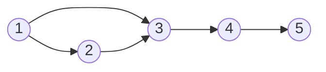
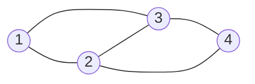

# Graph

Undirected graph

```mermaid
flowchart LR
1((1))
2((2))
3((3))
4((4))
5((5))
1 --> 3
1 --> 2
3 --> 4
2 --> 3
4 --> 5
```

Directed graph

```mermaid
flowchart LR
1((1))
2((2))
3((3))
4((4))
1 --- 3
1 --- 2
3 --- 4
2 --- 3
2 --- 4
```
