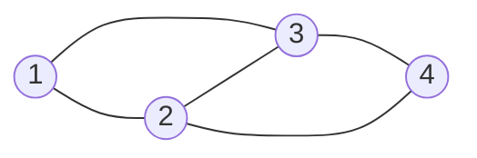
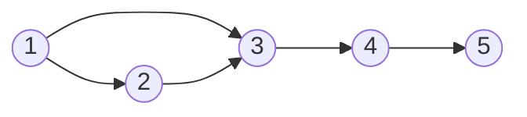
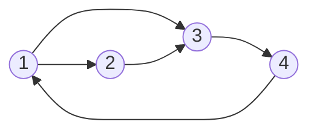
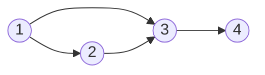
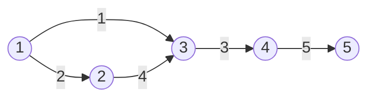
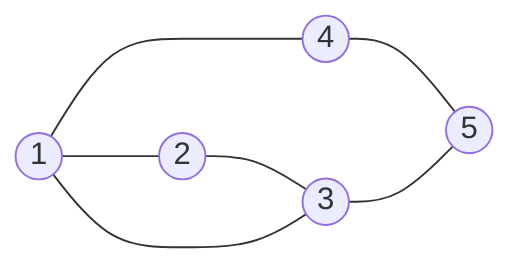
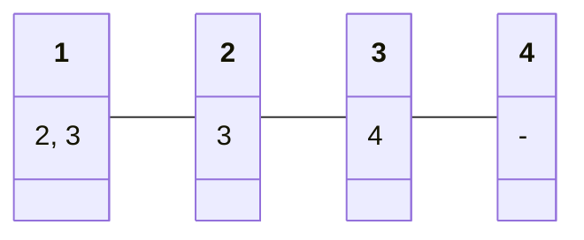

# Graph

## Concepts

- Graph
- Vertex (Node)
- Edge
- Weight

### Types

Undirected graph: A graph in which edges have no direction.



Directed graph: A graph in which edges have direction.



Cyclic graph: A graph in which there is a cycle.



Acyclic graph



Directed Acyclic Graph (DAG)


Weighted graph



Connected Graph



Sto

### Representation

1. Adjacency Matrix
2. Adjacency List


Adjacency Matrix

|            | Node 1 | Node 2 | Node 3 | Node 4 |
| :--------: | :----: | :----: | :----: | :----: |
| **Node 1** |   0    |   1    |   1    |   0    |
| **Node 2** |   0    |   0    |   1    |   0    |
| **Node 3** |   0    |   0    |   0    |   1    |
| **Node 4** |   0    |   0    |   0    |   0    |

```python
grid = [
    [0, 1, 1, 0],
    [0, 0, 1, 0],
    [0, 0, 0, 1],
    [0, 0, 0, 0]
]
```

Adjacency List



```python
graph = {
    1: [2, 3],
    2: [3],
    3: [4],
    4: []
}
```

### Degree

1. Degree: Number of edges connected to a node
2. In-degree: Number of edges coming into a node
3. Out-degree: Number of edges going out of a node


- In-degree of Node 1: 0
- Out-degree of Node 1: 2
- In-degree of Node 2: 1
- Out-degree of Node 2: 1

```python
# List
in_degree = [0, 1, 2, 1]
out_degree = [2, 1, 1, 0]

# Dict
in_degree = {1: 0, 2: 1, 3: 2, 4: 1}
out_degree = {1: 2, 2: 1, 3: 1, 4: 0}
```
