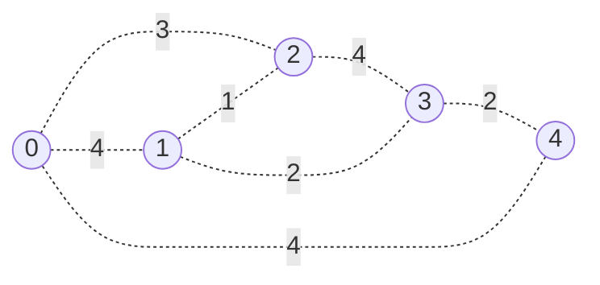

# Graph - Minimum Spanning Tree (MST)

## Minimum Spanning Tree

- **Tree**: a connected acyclic graph
- **Spanning Tree**: a subgraph that is a tree and connects all the vertices together
- **Minimum Spanning Tree (MST)**: a spanning tree with the minimum possible sum of edge weights

### Prim's Algorithm

- Greedy algorithm




```python
--8<-- "template/graph_mst.py"
```

## LeetCode Problems

1. 1584 - [Min Cost to Connect All Points](https://leetcode.com/problems/min-cost-to-connect-all-points/) (Medium)
2. 1135 - [Connecting Cities With Minimum Cost](https://leetcode.com/problems/connecting-cities-with-minimum-cost/) (Medium)
3. 1168 - [Optimize Water Distribution in a Village](https://leetcode.com/problems/optimize-water-distribution-in-a-village/) (Hard)
4. 1489 - [Find Critical and Pseudo-Critical Edges in Minimum Spanning Tree](https://leetcode.com/problems/find-critical-and-pseudo-critical-edges-in-minimum-spanning-tree/) (Hard)
5. 1631 - [Path With Minimum Effort](https://leetcode.com/problems/path-with-minimum-effort/) (Medium)
6. 1192 - [Critical Connections in a Network](https://leetcode.com/problems/critical-connections-in-a-network/) (Hard)
7. 1579 - [Remove Max Number of Edges to Keep Graph Fully Traversable](https://leetcode.com/problems/remove-max-number-of-edges-to-keep-graph-fully-traversable/) (Hard)
8. 1136 - [Parallel Courses](https://leetcode.com/problems/parallel-courses/) (Hard)
9. 0924 - [Minimize Malware Spread](https://leetcode.com/problems/minimize-malware-spread/) (Hard)
10. 1589 - [Maximum Sum Obtained of Any Permutation](https://leetcode.com/problems/maximum-sum-obtained-of-any-permutation/) (Medium)

## 1584. Min Cost to Connect All Points

```python
--8<-- "1584_min_cost_to_connect_all_points.py"
```

## 1135. Connecting Cities With Minimum Cost

```python
--8<-- "1135_connecting_cities_with_minimum_cost.py"
```

## 1168. Optimize Water Distribution in a Village

```python
--8<-- "1168_optimize_water_distribution_in_a_village.py"
```

## 1489. Find Critical and Pseudo-Critical Edges in Minimum Spanning Tree

```python
--8<-- "1489_find_critical_and_pseudo_critical_edges_in_minimum_spanning_tree.py"
```

## 1631. Path With Minimum Effort

```python
--8<-- "1631_path_with_minimum_effort.py"
```

## 1192. Critical Connections in a Network

```python
--8<-- "1192_critical_connections_in_a_network.py"
```

## 1579. Remove Max Number of Edges to Keep Graph Fully Traversable

```python
--8<-- "1579_remove_max_number_of_edges_to_keep_graph_fully_traversable.py"
```

## 1136. Parallel Courses

```python
--8<-- "1136_parallel_courses.py"
```

## 0924. Minimize Malware Spread

```python
--8<-- "0924_minimize_malware_spread.py"
```

## 1589. Maximum Sum Obtained of Any Permutation

```python
--8<-- "1589_maximum_sum_obtained_of_any_permutation.py"
```
