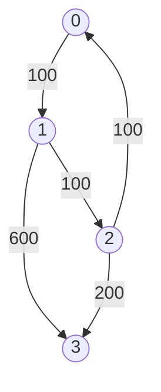

# Dijkstra's

## 787. Cheapest Flights Within K Stops

-  [LeetCode](https://leetcode.com/problems/cheapest-flights-within-k-stops/) | [LeetCode CH](https://leetcode.cn/problems/cheapest-flights-within-k-stops/) (Medium)

-   Return the cheapest price from `src` to `dst` with at most `K` stops.



<iframe width="560" height="315" src="https://www.youtube.com/embed/5eIK3zUdYmE?si=aBR0VbHXTgNuVlGz" title="YouTube video player" frameborder="0" allow="accelerometer; autoplay; clipboard-write; encrypted-media; gyroscope; picture-in-picture; web-share" referrerpolicy="strict-origin-when-cross-origin" allowfullscreen></iframe>

=== "Python"

    ```python
    --8<-- "0787_cheapest_flights_within_k_stops.py"
    ```

=== "C++"

    ```cpp
    --8<-- "cpp/0787_cheapest_flights_within_k_stops.cc"
    ```

=== "TypeScript"

    ```typescript
    --8<-- "ts/0787_cheapest_flights_within_k_stops.ts"
    ```

## 1514. Path with Maximum Probability

-  [LeetCode](https://leetcode.com/problems/path-with-maximum-probability/) | [LeetCode CH](https://leetcode.cn/problems/path-with-maximum-probability/) (Medium)

=== "Python"

    ```python
    --8<-- "1514_path_with_maximum_probability.py"
    ```

=== "C++"

    ```cpp
    --8<-- "cpp/1514_path_with_maximum_probability.cc"
    ```

=== "TypeScript"

    ```typescript
    --8<-- "ts/1514_path_with_maximum_probability.ts"
    ```

## 505. The Maze II

-  [LeetCode](https://leetcode.com/problems/the-maze-ii/) | [LeetCode CH](https://leetcode.cn/problems/the-maze-ii/) (Medium)

=== "Python"

    ```python
    --8<-- "0505_the_maze_ii.py"
    ```

=== "C++"

    ```cpp
    --8<-- "cpp/0505_the_maze_ii.cc"
    ```

=== "TypeScript"

    ```typescript
    --8<-- "ts/0505_the_maze_ii.ts"
    ```

## 499. The Maze III

-  [LeetCode](https://leetcode.com/problems/the-maze-iii/) | [LeetCode CH](https://leetcode.cn/problems/the-maze-iii/) (Hard)

=== "Python"

    ```python
    --8<-- "0499_the_maze_iii.py"
    ```

=== "C++"

    ```cpp
    --8<-- "cpp/0499_the_maze_iii.cc"
    ```

=== "TypeScript"

    ```typescript
    --8<-- "ts/0499_the_maze_iii.ts"
    ```
