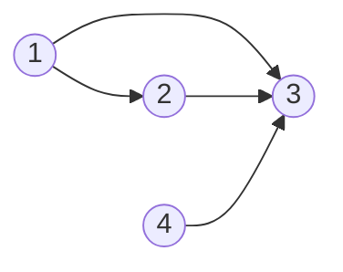

# Graph Theory

## 997. Find the Town Judge

-   `trust = [[1, 3], [2, 3], [1, 2], [4, 3]]`



=== "Python"

    ```python
    --8<-- "0997_find_the_town_judge.py"
    ```

=== "C++"

    ```cpp
    --8<-- "cpp/0997_find_the_town_judge.cc"
    ```

=== "TypeScript"

    ```typescript
    --8<-- "ts/0997_find_the_town_judge.ts"
    ```

## 1557. Minimum Number of Vertices to Reach All Nodes

-   Return a list of integers representing the minimum number of vertices needed to traverse all the nodes.
-   ✅ Return the vertices with indegree 0.

{width=300px}

-   `edges = [[0, 1], [0, 2], [2, 5], [3, 4], [4, 2]]`
-   Initialization

|   `src`   |  0  |  0  |  2  |  3  |  4  |     |
| :-------: | :-: | :-: | :-: | :-: | :-: | :-: |
|   `dst`   |  1  |  2  |  5  |  4  |  2  |     |
|   node    |  0  |  1  |  2  |  3  |  4  |  5  |
| in-degree |  0  |  0  |  0  |  0  |  0  |  0  |

|   `src`   |   0   |   0   |  2  |  3  |  4  |     |
| :-------: | :---: | :---: | :-: | :-: | :-: | :-: |
|   `dst`   | **1** |   2   |  5  |  4  |  2  |     |
|   node    |   0   | **1** |  2  |  3  |  4  |  5  |
| in-degree |   0   | **1** |  0  |  0  |  0  |  0  |

|   `src`   |  0  |   0   |   2   |  3  |  4  |     |
| :-------: | :-: | :---: | :---: | :-: | :-: | :-: |
|   `dst`   |  1  | **2** |   5   |  4  |  2  |     |
|   node    |  0  |   1   | **2** |  3  |  4  |  5  |
| in-degree |  0  |   1   | **1** |  0  |  0  |  0  |

|   `src`   |  0  |  0  |   2   |  3  |  4  |       |
| :-------: | :-: | :-: | :---: | :-: | :-: | :---: |
|   `dst`   |  1  |  2  | **5** |  4  |  2  |       |
|   node    |  0  |  1  |   2   |  3  |  4  | **5** |
| in-degree |  0  |  1  |   1   |  0  |  0  | **1** |

|   `src`   |  0  |  0  |  2  |   3   |   4   |     |
| :-------: | :-: | :-: | :-: | :---: | :---: | :-: |
|   `dst`   |  1  |  2  |  5  | **4** |   2   |     |
|   node    |  0  |  1  |  2  |   3   | **4** |  5  |
| in-degree |  0  |  1  |  1  |   0   | **1** |  1  |

|   `src`   |  0  |  0  |   2   |  3  |   4   |     |
| :-------: | :-: | :-: | :---: | :-: | :---: | :-: |
|   `dst`   |  1  |  2  |   5   |  4  | **2** |     |
|   node    |  0  |  1  | **2** |  3  |   4   |  5  |
| in-degree |  0  |  1  | **2** |  0  |   1   |  1  |

=== "Python"

    ```python
    --8<-- "1557_minimum_number_of_vertices_to_reach_all_nodes.py"
    ```

=== "C++"

    ```cpp
    --8<-- "cpp/1557_minimum_number_of_vertices_to_reach_all_nodes.cc"
    ```

=== "TypeScript"

    ```typescript
    --8<-- "ts/1557_minimum_number_of_vertices_to_reach_all_nodes.ts"
    ```

## 1615. Maximal Network Rank

=== "Python"

    ```python
    --8<-- "1615_maximal_network_rank.py"
    ```

=== "C++"

    ```cpp
    --8<-- "cpp/1615_maximal_network_rank.cc"
    ```

=== "TypeScript"

    ```typescript
    --8<-- "ts/1615_maximal_network_rank.ts"
    ```

## 785. Is Graph Bipartite?

=== "Python"

    ```python
    --8<-- "0785_is_graph_bipartite.py"
    ```

=== "C++"

    ```cpp
    --8<-- "cpp/0785_is_graph_bipartite.cc"
    ```

=== "TypeScript"

    ```typescript
    --8<-- "ts/0785_is_graph_bipartite.ts"
    ```

## 261. Graph Valid Tree

=== "Python"

    ```python
    --8<-- "0261_graph_valid_tree.py"
    ```

=== "C++"

    ```cpp
    --8<-- "cpp/0261_graph_valid_tree.cc"
    ```

=== "TypeScript"

    ```typescript
    --8<-- "ts/0261_graph_valid_tree.ts"
    ```
