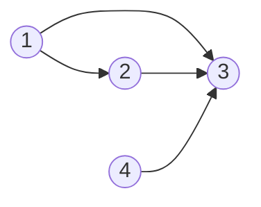
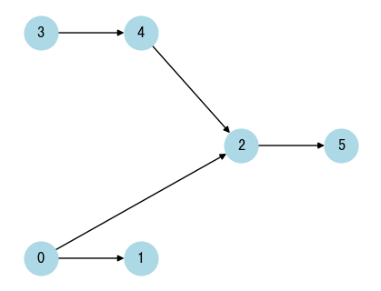

# Graph Theory

- [x] [997. Find the Town Judge](https://leetcode.cn/problems/find-the-town-judge/) (Easy)
- [x] [1557. Minimum Number of Vertices to Reach All Nodes](https://leetcode.cn/problems/minimum-number-of-vertices-to-reach-all-nodes/) (Medium)
- [x] [1615. Maximal Network Rank](https://leetcode.cn/problems/maximal-network-rank/) (Medium)
- [x] [785. Is Graph Bipartite?](https://leetcode.cn/problems/is-graph-bipartite/) (Medium)
- [x] [261. Graph Valid Tree](https://leetcode.cn/problems/graph-valid-tree/) (Medium)

## 997. Find the Town Judge

-   [LeetCode](https://leetcode.com/problems/find-the-town-judge/) | [LeetCode CH](https://leetcode.cn/problems/find-the-town-judge/) (Easy)
-   Tags: array, hash table, graph
-   `trust = [[1, 3], [2, 3], [1, 2], [4, 3]]`



```python title="997. Find the Town Judge - Python Solution"
--8<-- "0997_find_the_town_judge.py"
```

## 1557. Minimum Number of Vertices to Reach All Nodes

-   [LeetCode](https://leetcode.com/problems/minimum-number-of-vertices-to-reach-all-nodes/) | [LeetCode CH](https://leetcode.cn/problems/minimum-number-of-vertices-to-reach-all-nodes/) (Medium)
-   Tags: graph
-   Return a list of integers representing the minimum number of vertices needed to traverse all the nodes.
-   ✅ Return the vertices with indegree 0.

{width=300px}

-   `edges = [[0, 1], [0, 2], [2, 5], [3, 4], [4, 2]]`
-   Initialization

|   `src`   |  0  |  0  |  2  |  3  |  4  |     |
| :-------: | :-: | :-: | :-: | :-: | :-: | :-: |
|   `dst`   |  1  |  2  |  5  |  4  |  2  |     |
|   node    |  0  |  1  |  2  |  3  |  4  |  5  |
| in-degree |  0  |  0  |  0  |  0  |  0  |  0  |

|   `src`   |   0   |   0   |  2  |  3  |  4  |     |
| :-------: | :---: | :---: | :-: | :-: | :-: | :-: |
|   `dst`   | **1** |   2   |  5  |  4  |  2  |     |
|   node    |   0   | **1** |  2  |  3  |  4  |  5  |
| in-degree |   0   | **1** |  0  |  0  |  0  |  0  |

|   `src`   |  0  |   0   |   2   |  3  |  4  |     |
| :-------: | :-: | :---: | :---: | :-: | :-: | :-: |
|   `dst`   |  1  | **2** |   5   |  4  |  2  |     |
|   node    |  0  |   1   | **2** |  3  |  4  |  5  |
| in-degree |  0  |   1   | **1** |  0  |  0  |  0  |

|   `src`   |  0  |  0  |   2   |  3  |  4  |       |
| :-------: | :-: | :-: | :---: | :-: | :-: | :---: |
|   `dst`   |  1  |  2  | **5** |  4  |  2  |       |
|   node    |  0  |  1  |   2   |  3  |  4  | **5** |
| in-degree |  0  |  1  |   1   |  0  |  0  | **1** |

|   `src`   |  0  |  0  |  2  |   3   |   4   |     |
| :-------: | :-: | :-: | :-: | :---: | :---: | :-: |
|   `dst`   |  1  |  2  |  5  | **4** |   2   |     |
|   node    |  0  |  1  |  2  |   3   | **4** |  5  |
| in-degree |  0  |  1  |  1  |   0   | **1** |  1  |

|   `src`   |  0  |  0  |   2   |  3  |   4   |     |
| :-------: | :-: | :-: | :---: | :-: | :---: | :-: |
|   `dst`   |  1  |  2  |   5   |  4  | **2** |     |
|   node    |  0  |  1  | **2** |  3  |   4   |  5  |
| in-degree |  0  |  1  | **2** |  0  |   1   |  1  |

```python title="1557. Minimum Number of Vertices to Reach All Nodes - Python Solution"
--8<-- "1557_minimum_number_of_vertices_to_reach_all_nodes.py"
```

## 1615. Maximal Network Rank

-   [LeetCode](https://leetcode.com/problems/maximal-network-rank/) | [LeetCode CH](https://leetcode.cn/problems/maximal-network-rank/) (Medium)
-   Tags: graph

```python title="1615. Maximal Network Rank - Python Solution"
--8<-- "1615_maximal_network_rank.py"
```

## 785. Is Graph Bipartite?

-   [LeetCode](https://leetcode.com/problems/is-graph-bipartite/) | [LeetCode CH](https://leetcode.cn/problems/is-graph-bipartite/) (Medium)
-   Tags: depth first search, breadth first search, union find, graph
-   Determine if a graph is bipartite.

How to group

|          | Uncolored | Color 1 | Color 2 | Operation   |
| -------- | --------- | ------- | ------- | ----------- |
| Method 1 | -1        | 0       | 1       | `1 - color` |
| Method 2 | 0         | 1       | -1      | `-color`    |

```python title="785. Is Graph Bipartite? - Python Solution"
--8<-- "0785_is_graph_bipartite.py"
```

## 261. Graph Valid Tree

-   [LeetCode](https://leetcode.com/problems/graph-valid-tree/) | [LeetCode CH](https://leetcode.cn/problems/graph-valid-tree/) (Medium)
-   Tags: depth first search, breadth first search, union find, graph

```python title="261. Graph Valid Tree - Python Solution"
--8<-- "0261_graph_valid_tree.py"
```
