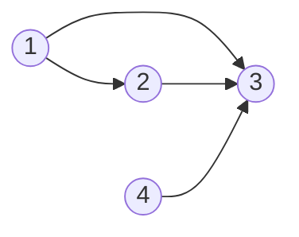

# Graph Theory

## 997. Find the Town Judge

-   `trust = [[1, 3], [2, 3], [1, 2], [4, 3]]`



=== "Python"

    ```python
    --8<-- "0997_find_the_town_judge.py"
    ```

=== "C++"

    ```cpp
    --8<-- "cpp/0997_find_the_town_judge.cc"
    ```

=== "TypeScript"

    ```typescript
    --8<-- "ts/0997_find_the_town_judge.ts"
    ```

## 1557. Minimum Number Of Vertices To Reach All Nodes

=== "Python"

    ```python
    --8<-- "1557_minimum_number_of_vertices_to_reach_all_nodes.py"
    ```

=== "C++"

    ```cpp
    --8<-- "cpp/1557_minimum_number_of_vertices_to_reach_all_nodes.cc"
    ```

=== "TypeScript"

    ```typescript
    --8<-- "ts/1557_minimum_number_of_vertices_to_reach_all_nodes.ts"
    ```

## 1615. Maximal Network Rank

=== "Python"

    ```python
    --8<-- "1615_maximal_network_rank.py"
    ```

=== "C++"

    ```cpp
    --8<-- "cpp/1615_maximal_network_rank.cc"
    ```

=== "TypeScript"

    ```typescript
    --8<-- "ts/1615_maximal_network_rank.ts"
    ```

## 785. Is Graph Bipartite

=== "Python"

    ```python
    --8<-- "0785_is_graph_bipartite.py"
    ```

=== "C++"

    ```cpp
    --8<-- "cpp/0785_is_graph_bipartite.cc"
    ```

=== "TypeScript"

    ```typescript
    --8<-- "ts/0785_is_graph_bipartite.ts"
    ```

## 261. Graph Valid Tree

=== "Python"

    ```python
    --8<-- "0261_graph_valid_tree.py"
    ```

=== "C++"

    ```cpp
    --8<-- "cpp/0261_graph_valid_tree.cc"
    ```

=== "TypeScript"

    ```typescript
    --8<-- "ts/0261_graph_valid_tree.ts"
    ```
