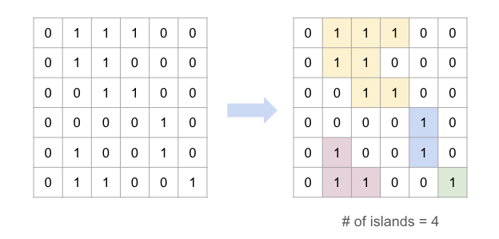

# Matrix Graphs

- [x] [200. Number of Islands](https://leetcode.cn/problems/number-of-islands/) (Medium)
- [x] [1020. Number of Enclaves](https://leetcode.cn/problems/number-of-enclaves/) (Medium)
- [x] [1254. Number of Closed Islands](https://leetcode.cn/problems/number-of-closed-islands/) (Medium)
- [x] [695. Max Area of Island](https://leetcode.cn/problems/max-area-of-island/) (Medium)
- [x] [417. Pacific Atlantic Water Flow](https://leetcode.cn/problems/pacific-atlantic-water-flow/) (Medium)

## 200. Number of Islands

-   [LeetCode](https://leetcode.com/problems/number-of-islands/) | [LeetCode CH](https://leetcode.cn/problems/number-of-islands/) (Medium)

-   Tags: array, depth first search, breadth first search, union find, matrix
-   Count the number of islands in a 2D grid.
-   Method 1: DFS
-   Method 2: BFS (use a queue to traverse the grid)

-   How to keep track of visited cells?

    1. Mark the visited cell as `0` (or any other value) to avoid revisiting it.
    2. Use a set to store the visited cells.

-   Steps:
    1. Init: variables
    2. DFS/BFS: starting from the cell with `1`, turn all the connected `1`s to `0`.
    3. Traverse the grid, and if the cell is `1`, increment the count and call DFS/BFS.



```python title="200. Number of Islands - Python Solution"
--8<-- "0200_number_of_islands.py"
```

```cpp title="200. Number of Islands - C++ Solution"
--8<-- "cpp/0200_number_of_islands.cc"
```

## 1020. Number of Enclaves

-   [LeetCode](https://leetcode.com/problems/number-of-enclaves/) | [LeetCode CH](https://leetcode.cn/problems/number-of-enclaves/) (Medium)

-   Tags: array, depth first search, breadth first search, union find, matrix

```python title="1020. Number of Enclaves - Python Solution"
--8<-- "1020_number_of_enclaves.py"
```

## 1254. Number of Closed Islands

-   [LeetCode](https://leetcode.com/problems/number-of-closed-islands/) | [LeetCode CH](https://leetcode.cn/problems/number-of-closed-islands/) (Medium)

-   Tags: array, depth first search, breadth first search, union find, matrix

```python title="1254. Number of Closed Islands - Python Solution"
--8<-- "1254_number_of_closed_islands.py"
```

## 695. Max Area of Island

-   [LeetCode](https://leetcode.com/problems/max-area-of-island/) | [LeetCode CH](https://leetcode.cn/problems/max-area-of-island/) (Medium)

-   Tags: array, depth first search, breadth first search, union find, matrix

```python title="695. Max Area of Island - Python Solution"
--8<-- "0695_max_area_of_island.py"
```

## 417. Pacific Atlantic Water Flow

-   [LeetCode](https://leetcode.com/problems/pacific-atlantic-water-flow/) | [LeetCode CH](https://leetcode.cn/problems/pacific-atlantic-water-flow/) (Medium)

-   Tags: array, depth first search, breadth first search, matrix

```python title="417. Pacific Atlantic Water Flow - Python Solution"
--8<-- "0417_pacific_atlantic_water_flow.py"
```
