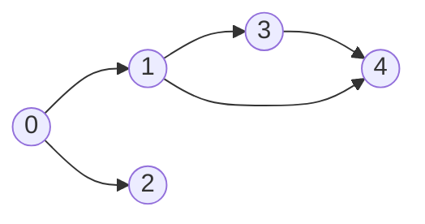
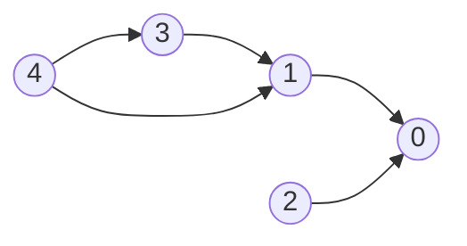
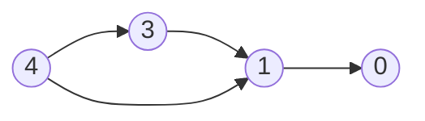
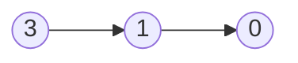
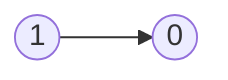

# Topological Sort

## 207. Course Schedule

-   Return true if it is possible to finish all courses, otherwise return false.
-   Dependency relationships imply the topological sort algorithm.
-   Cycle detection






| course       | 0   | 0   | 1   | 1   | 3   |
| ------------ | --- | --- | --- | --- | --- |
| prerequisite | 1   | 2   | 3   | 4   | 4   |

| index     | 0   | 1   | 2   | 3   | 4   |
| --------- | --- | --- | --- | --- | --- |
| in-degree | 0   | 0   | 0   | 0   | 0   |

Initialize

-   graph

| prerequisite | 1     | 2     | 3     | 4        |
| ------------ | ----- | ----- | ----- | -------- |
| course       | `[0]` | `[0]` | `[1]` | `[1, 3]` |

-   in-degree

|           | 0   | 1   | 2   | 3   | 4   |
| --------- | --- | --- | --- | --- | --- |
| in-degree | 2   | 2   | 0   | 1   | 0   |

-   queue: `[2, 4]`

Pop `2` from the queue



|           | 0   | 1   | 2   | 3   | 4   |
| --------- | --- | --- | --- | --- | --- |
| in-degree | 1   | 2   | 0   | 1   | 0   |

-   queue: `[4]`

Pop `4` from the queue



|           | 0   | 1   | 2   | 3   | 4   |
| --------- | --- | --- | --- | --- | --- |
| in-degree | 1   | 1   | 0   | 0   | 0   |

-   queue: `[3]`

Pop `3` from the queue



|           | 0   | 1   | 2   | 3   | 4   |
| --------- | --- | --- | --- | --- | --- |
| in-degree | 1   | 0   | 0   | 0   | 0   |

-   queue: `[1]`

Pop `1` from the queue


|           | 0   | 1   | 2   | 3   | 4   |
| --------- | --- | --- | --- | --- | --- |
| in-degree | 0   | 0   | 0   | 0   | 0   |

-   queue: `[0]`

Pop `0` from the queue

=== "Python"

    ```python
    --8<-- "0207_course_schedule.py"
    ```

=== "C++"

    ```cpp
    --8<-- "cpp/0207_course_schedule.cc"
    ```

=== "TypeScript"

    ```typescript
    --8<-- "ts/0207_course_schedule.ts"
    ```

## 210. Course Schedule II

=== "Python"

    ```python
    --8<-- "0210_course_schedule_ii.py"
    ```

=== "C++"

    ```cpp
    --8<-- "cpp/0210_course_schedule_ii.cc"
    ```

=== "TypeScript"

    ```typescript
    --8<-- "ts/0210_course_schedule_ii.ts"
    ```

## 269. Alien Dictionary

=== "Python"

    ```python
    --8<-- "0269_alien_dictionary.py"
    ```

=== "C++"

    ```cpp
    --8<-- "cpp/0269_alien_dictionary.cc"
    ```

=== "TypeScript"

    ```typescript
    --8<-- "ts/0269_alien_dictionary.ts"
    ```

## 1203. Sort Items by Groups Respecting Dependencies

=== "Python"

    ```python
    --8<-- "1203_sort_items_by_groups_respecting_dependencies.py"
    ```

=== "C++"

    ```cpp
    --8<-- "cpp/1203_sort_items_by_groups_respecting_dependencies.cc"
    ```

=== "TypeScript"

    ```typescript
    --8<-- "ts/1203_sort_items_by_groups_respecting_dependencies.ts"
    ```

## 1857. Largest Color Value in a Directed Graph

=== "Python"

    ```python
    --8<-- "1857_largest_color_value_in_a_directed_graph.py"
    ```

=== "C++"

    ```cpp
    --8<-- "cpp/1857_largest_color_value_in_a_directed_graph.cc"
    ```

=== "TypeScript"

    ```typescript
    --8<-- "ts/1857_largest_color_value_in_a_directed_graph.ts"
    ```
