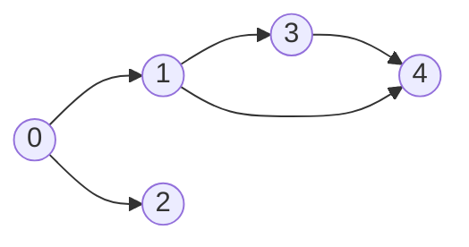
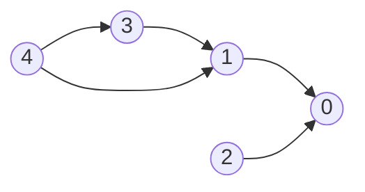
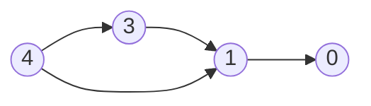
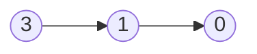
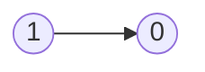

# Topological Sort

## 207. Course Schedule

-  [LeetCode](https://leetcode.com/problems/course-schedule/) | [LeetCode CH](https://leetcode.cn/problems/course-schedule/) (Medium)

-   Return true if it is possible to finish all courses, otherwise return false.
-   Dependency relationships imply the topological sort algorithm.
-   Cycle detection
-   Topological Sort
    -   DAG (Directed Acyclic Graph)
    -   Time complexity: O(V+E)
    -   Space complexity: O(V+E)
    -   Prerequisites: Indegree (Look at the problem [1557. Minimum Number of Vertices to Reach All Nodes](#1557-minimum-number-of-vertices-to-reach-all-nodes))
        -   Indegree: Number of incoming edges to a vertex
    -   Applications: task scheduling, course scheduling, build systems, dependency resolution, compiler optimization, etc.

{width=300px}

{width=300px}

Course to prerequisites mapping



Prerequisites to course mapping



| course       | 0   | 0   | 1   | 1   | 3   |
| ------------ | --- | --- | --- | --- | --- |
| prerequisite | 1   | 2   | 3   | 4   | 4   |

| index     | 0   | 1   | 2   | 3   | 4   |
| --------- | --- | --- | --- | --- | --- |
| in-degree | 0   | 0   | 0   | 0   | 0   |

Initialize

-   graph

| prerequisite | 1     | 2     | 3     | 4        |
| ------------ | ----- | ----- | ----- | -------- |
| course       | `[0]` | `[0]` | `[1]` | `[1, 3]` |

-   in-degree

|           | 0   | 1   | 2   | 3   | 4   |
| --------- | --- | --- | --- | --- | --- |
| in-degree | 2   | 2   | 0   | 1   | 0   |

-   queue: `[2, 4]`
-   pop `2` from the queue



|           | 0   | 1   | 2   | 3   | 4   |
| --------- | --- | --- | --- | --- | --- |
| in-degree | 1   | 2   | 0   | 1   | 0   |

-   queue: `[4]`
-   pop `4` from the queue



|           | 0   | 1   | 2   | 3   | 4   |
| --------- | --- | --- | --- | --- | --- |
| in-degree | 1   | 1   | 0   | 0   | 0   |

-   queue: `[3]`
-   pop `3` from the queue



|           | 0   | 1   | 2   | 3   | 4   |
| --------- | --- | --- | --- | --- | --- |
| in-degree | 1   | 0   | 0   | 0   | 0   |

-   queue: `[1]`
-   pop `1` from the queue


|           | 0   | 1   | 2   | 3   | 4   |
| --------- | --- | --- | --- | --- | --- |
| in-degree | 0   | 0   | 0   | 0   | 0   |

-   queue: `[0]`
-   pop `0` from the queue
-   All courses are taken. Return `True`.

=== "Python"

    ```python
    --8<-- "0207_course_schedule.py"
    ```

=== "C++"

    ```cpp
    --8<-- "cpp/0207_course_schedule.cc"
    ```

=== "TypeScript"

    ```typescript
    --8<-- "ts/0207_course_schedule.ts"
    ```

## 210. Course Schedule II

-  [LeetCode](https://leetcode.com/problems/course-schedule-ii/) | [LeetCode CH](https://leetcode.cn/problems/course-schedule-ii/) (Medium)

-   Return the ordering of courses you should take to finish all courses. If there are multiple valid answers, return any of them.

{width=300px}

=== "Python"

    ```python
    --8<-- "0210_course_schedule_ii.py"
    ```

=== "C++"

    ```cpp
    --8<-- "cpp/0210_course_schedule_ii.cc"
    ```

=== "TypeScript"

    ```typescript
    --8<-- "ts/0210_course_schedule_ii.ts"
    ```

## 269. Alien Dictionary

-  [LeetCode](https://leetcode.com/problems/alien-dictionary/) | [LeetCode CH](https://leetcode.cn/problems/alien-dictionary/) (Hard)

-   Return the correct order of characters in the alien language.

=== "Python"

    ```python
    --8<-- "0269_alien_dictionary.py"
    ```

=== "C++"

    ```cpp
    --8<-- "cpp/0269_alien_dictionary.cc"
    ```

=== "TypeScript"

    ```typescript
    --8<-- "ts/0269_alien_dictionary.ts"
    ```

## 1203. Sort Items by Groups Respecting Dependencies

-  [LeetCode](https://leetcode.com/problems/sort-items-by-groups-respecting-dependencies/) | [LeetCode CH](https://leetcode.cn/problems/sort-items-by-groups-respecting-dependencies/) (Hard)

-   Return any permutation of the items that satisfies the requirements.

=== "Python"

    ```python
    --8<-- "1203_sort_items_by_groups_respecting_dependencies.py"
    ```

=== "C++"

    ```cpp
    --8<-- "cpp/1203_sort_items_by_groups_respecting_dependencies.cc"
    ```

=== "TypeScript"

    ```typescript
    --8<-- "ts/1203_sort_items_by_groups_respecting_dependencies.ts"
    ```

## 1857. Largest Color Value in a Directed Graph

-  [LeetCode](https://leetcode.com/problems/largest-color-value-in-a-directed-graph/) | [LeetCode CH](https://leetcode.cn/problems/largest-color-value-in-a-directed-graph/) (Hard)

=== "Python"

    ```python
    --8<-- "1857_largest_color_value_in_a_directed_graph.py"
    ```

=== "C++"

    ```cpp
    --8<-- "cpp/1857_largest_color_value_in_a_directed_graph.cc"
    ```

=== "TypeScript"

    ```typescript
    --8<-- "ts/1857_largest_color_value_in_a_directed_graph.ts"
    ```
