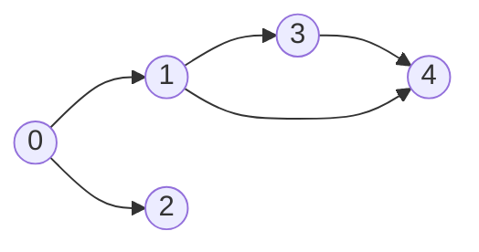
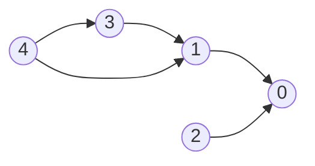
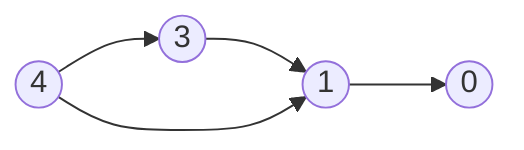
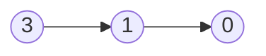
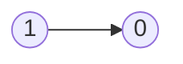
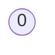

# Graph

## 733. Flood Fill

-  [LeetCode](https://leetcode.com/problems/flood-fill/) | [LeetCode CH](https://leetcode.cn/problems/flood-fill/) (Easy)

-   Replace all the pixels of the same color starting from the given pixel.
-   In other words, find the connected component of the starting pixel and change the color of all the pixels in that component.
-   Edge cases: If the starting pixel is already the target color, return the image as it is.
-   **Flood Fill** is essentially a graph traversal algorithm (like BFS or DFS) applied to matrices (2D grids).
    It checks adjacent cells (up, down, left, right) of a starting point to determine whether they belong to the same region.
    Typically, it involves modifying or marking the cells that belong to the same connected component.

{width=300px}


|  1  |   1   |  1  |
| :-: | :---: | :-: |
|  1  | ==1== |  0  |
|  1  |   0   |  1  |

|  1  |   1   |  1  |
| :-: | :---: | :-: |
|  1  | ==2== |  0  |
|  1  |   0   |  1  |

|   1   | ==2== |  1  |
| :---: | :---: | :-: |
| ==2== | ==2== |  0  |
|   1   |   0   |  1  |

| ==2== | ==2== | ==2== |
| :---: | :---: | :---: |
| ==2== | ==2== |   0   |
| ==2== |   0   |   1   |

=== "Python"

    ```python
    --8<-- "0733_flood_fill.py"
    ```

=== "C++"

    ```cpp
    --8<-- "cpp/0733_flood_fill.cc"
    ```

=== "TypeScript"

    ```typescript
    --8<-- "ts/0733_flood_fill.ts"
    ```

## 542. 01 Matrix

-  [LeetCode](https://leetcode.com/problems/01-matrix/) | [LeetCode CH](https://leetcode.cn/problems/01-matrix/) (Medium)

=== "Python"

    ```python
    --8<-- "0542_01_matrix.py"
    ```

=== "C++"

    ```cpp
    --8<-- "cpp/0542_01_matrix.cc"
    ```

=== "TypeScript"

    ```typescript
    --8<-- "ts/0542_01_matrix.ts"
    ```

## 133. Clone Graph

-  [LeetCode](https://leetcode.com/problems/clone-graph/) | [LeetCode CH](https://leetcode.cn/problems/clone-graph/) (Medium)

=== "Python"

    ```python
    --8<-- "0133_clone_graph.py"
    ```

=== "C++"

    ```cpp
    --8<-- "cpp/0133_clone_graph.cc"
    ```

=== "TypeScript"

    ```typescript
    --8<-- "ts/0133_clone_graph.ts"
    ```

## 207. Course Schedule

-  [LeetCode](https://leetcode.com/problems/course-schedule/) | [LeetCode CH](https://leetcode.cn/problems/course-schedule/) (Medium)

-   Return true if it is possible to finish all courses, otherwise return false.
-   Dependency relationships imply the topological sort algorithm.
-   Cycle detection
-   Topological Sort
    -   DAG (Directed Acyclic Graph)
    -   Time complexity: O(V+E)
    -   Space complexity: O(V+E)
    -   Prerequisites: Indegree (Look at the problem [1557. Minimum Number of Vertices to Reach All Nodes](#1557-minimum-number-of-vertices-to-reach-all-nodes))
        -   Indegree: Number of incoming edges to a vertex
    -   Applications: task scheduling, course scheduling, build systems, dependency resolution, compiler optimization, etc.

{width=300px}

{width=300px}

Course to prerequisites mapping



Prerequisites to course mapping



| course       | 0   | 0   | 1   | 1   | 3   |
| ------------ | --- | --- | --- | --- | --- |
| prerequisite | 1   | 2   | 3   | 4   | 4   |

| index     | 0   | 1   | 2   | 3   | 4   |
| --------- | --- | --- | --- | --- | --- |
| in-degree | 0   | 0   | 0   | 0   | 0   |

Initialize

-   graph

| prerequisite | 1     | 2     | 3     | 4        |
| ------------ | ----- | ----- | ----- | -------- |
| course       | `[0]` | `[0]` | `[1]` | `[1, 3]` |

-   in-degree

|           | 0   | 1   | 2   | 3   | 4   |
| --------- | --- | --- | --- | --- | --- |
| in-degree | 2   | 2   | 0   | 1   | 0   |

-   queue: `[2, 4]`
-   pop `2` from the queue



|           | 0   | 1   | 2   | 3   | 4   |
| --------- | --- | --- | --- | --- | --- |
| in-degree | 1   | 2   | 0   | 1   | 0   |

-   queue: `[4]`
-   pop `4` from the queue



|           | 0   | 1   | 2   | 3   | 4   |
| --------- | --- | --- | --- | --- | --- |
| in-degree | 1   | 1   | 0   | 0   | 0   |

-   queue: `[3]`
-   pop `3` from the queue



|           | 0   | 1   | 2   | 3   | 4   |
| --------- | --- | --- | --- | --- | --- |
| in-degree | 1   | 0   | 0   | 0   | 0   |

-   queue: `[1]`
-   pop `1` from the queue



|           | 0   | 1   | 2   | 3   | 4   |
| --------- | --- | --- | --- | --- | --- |
| in-degree | 0   | 0   | 0   | 0   | 0   |

-   queue: `[0]`
-   pop `0` from the queue
-   All courses are taken. Return `True`.

=== "Python"

    ```python
    --8<-- "0207_course_schedule.py"
    ```

=== "C++"

    ```cpp
    --8<-- "cpp/0207_course_schedule.cc"
    ```

=== "TypeScript"

    ```typescript
    --8<-- "ts/0207_course_schedule.ts"
    ```

## 200. Number of Islands

-  [LeetCode](https://leetcode.com/problems/number-of-islands/) | [LeetCode CH](https://leetcode.cn/problems/number-of-islands/) (Medium)

-   Count the number of islands in a 2D grid.
-   Method 1: DFS
-   Method 2: BFS (use a queue to traverse the grid)

-   How to keep track of visited cells?

    1. Mark the visited cell as `0` (or any other value) to avoid revisiting it.
    2. Use a set to store the visited cells.

-   Steps:
    1. Init: variables
    2. DFS/BFS: starting from the cell with `1`, turn all the connected `1`s to `0`.
    3. Traverse the grid, and if the cell is `1`, increment the count and call DFS/BFS.


=== "Python"

    ```python
    --8<-- "0200_number_of_islands.py"
    ```

=== "C++"

    ```cpp
    --8<-- "cpp/0200_number_of_islands.cc"
    ```

=== "TypeScript"

    ```typescript
    --8<-- "ts/0200_number_of_islands.ts"
    ```

## 994. Rotting Oranges

-  [LeetCode](https://leetcode.com/problems/rotting-oranges/) | [LeetCode CH](https://leetcode.cn/problems/rotting-oranges/) (Medium)

-   Return the minimum number of minutes that must elapse until no cell has a fresh orange.
-   Hint: Multi-source BFS to count the level.


=== "Python"

    ```python
    --8<-- "0994_rotting_oranges.py"
    ```

=== "C++"

    ```cpp
    --8<-- "cpp/0994_rotting_oranges.cc"
    ```

=== "TypeScript"

    ```typescript
    --8<-- "ts/0994_rotting_oranges.ts"
    ```

## 721. Accounts Merge

-  [LeetCode](https://leetcode.com/problems/accounts-merge/) | [LeetCode CH](https://leetcode.cn/problems/accounts-merge/) (Medium)

=== "Python"

    ```python
    --8<-- "0721_accounts_merge.py"
    ```

=== "C++"

    ```cpp
    --8<-- "cpp/0721_accounts_merge.cc"
    ```

=== "TypeScript"

    ```typescript
    --8<-- "ts/0721_accounts_merge.ts"
    ```

## 79. Word Search

-  [LeetCode](https://leetcode.com/problems/word-search/) | [LeetCode CH](https://leetcode.cn/problems/word-search/) (Medium)

=== "Python"

    ```python
    --8<-- "0079_word_search.py"
    ```

=== "C++"

    ```cpp
    --8<-- "cpp/0079_word_search.cc"
    ```

=== "TypeScript"

    ```typescript
    --8<-- "ts/0079_word_search.ts"
    ```

## 127. Word Ladder

-  [LeetCode](https://leetcode.com/problems/word-ladder/) | [LeetCode CH](https://leetcode.cn/problems/word-ladder/) (Hard)

=== "Python"

    ```python
    --8<-- "0127_word_ladder.py"
    ```

=== "C++"

    ```cpp
    --8<-- "cpp/0127_word_ladder.cc"
    ```

=== "TypeScript"

    ```typescript
    --8<-- "ts/0127_word_ladder.ts"
    ```
