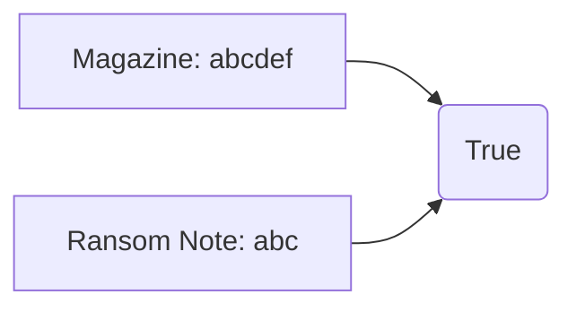

# Hash Table

- [x] [383. Ransom Note](https://leetcode.cn/problems/ransom-note/) (Easy)

## 383. Ransom Note

-   [LeetCode](https://leetcode.com/problems/ransom-note/) | [LeetCode CH](https://leetcode.cn/problems/ransom-note/) (Easy)
-   Tags: hash table, string, counting
-   Return `True` if the ransom note can be constructed from the magazines, otherwise, return `False`.



```python title="383. Ransom Note"
--8<-- "0383_ransom_note.py"
```
