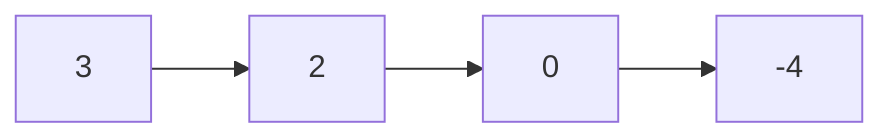
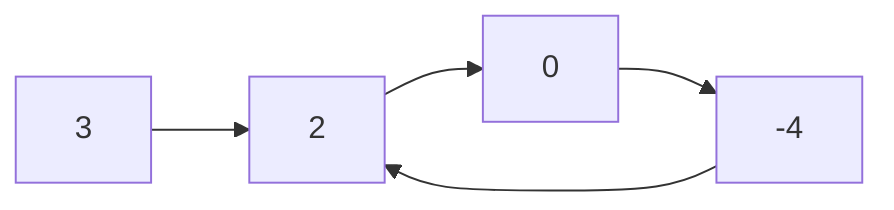
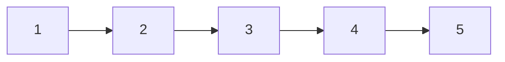
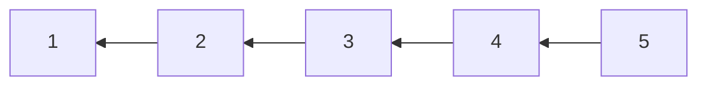

# Linked List

- [x] [21. Merge Two Sorted Lists](https://leetcode.cn/problems/merge-two-sorted-lists/) (Easy)
- [x] [141. Linked List Cycle](https://leetcode.cn/problems/linked-list-cycle/) (Easy)
- [x] [206. Reverse Linked List](https://leetcode.cn/problems/reverse-linked-list/) (Easy)
- [x] [876. Middle of the Linked List](https://leetcode.cn/problems/middle-of-the-linked-list/) (Easy)
- [x] [146. LRU Cache](https://leetcode.cn/problems/lru-cache/) (Medium)

## 21. Merge Two Sorted Lists

-   [LeetCode](https://leetcode.com/problems/merge-two-sorted-lists/) | [LeetCode CH](https://leetcode.cn/problems/merge-two-sorted-lists/) (Easy)

-   Tags: linked list, recursion
-   Merge the two lists into one sorted list.

<iframe width="560" height="315" src="https://www.youtube.com/embed/XIdigk956u0?si=2cVoU6DujA3Mgtlr" title="YouTube video player" frameborder="0" allow="accelerometer; autoplay; clipboard-write; encrypted-media; gyroscope; picture-in-picture; web-share" referrerpolicy="strict-origin-when-cross-origin" allowfullscreen></iframe>

```python title="21. Merge Two Sorted Lists - Python Solution"
--8<-- "0021_merge_two_sorted_lists.py"
```

## 141. Linked List Cycle

-   [LeetCode](https://leetcode.com/problems/linked-list-cycle/) | [LeetCode CH](https://leetcode.cn/problems/linked-list-cycle/) (Easy)

-   Tags: hash table, linked list, two pointers
-   Determine if a linked list has a cycle in it.





```python title="141. Linked List Cycle - Python Solution"
--8<-- "0141_linked_list_cycle.py"
```

## 206. Reverse Linked List

-   [LeetCode](https://leetcode.com/problems/reverse-linked-list/) | [LeetCode CH](https://leetcode.cn/problems/reverse-linked-list/) (Easy)

-   Tags: linked list, recursion
-   Reverse a singly linked list.





```python title="206. Reverse Linked List - Python Solution"
--8<-- "0206_reverse_linked_list.py"
```

## 876. Middle of the Linked List

-   [LeetCode](https://leetcode.com/problems/middle-of-the-linked-list/) | [LeetCode CH](https://leetcode.cn/problems/middle-of-the-linked-list/) (Easy)

-   Tags: linked list, two pointers

```python title="876. Middle of the Linked List - Python Solution"
--8<-- "0876_middle_of_the_linked_list.py"
```

## 146. LRU Cache

-   [LeetCode](https://leetcode.com/problems/lru-cache/) | [LeetCode CH](https://leetcode.cn/problems/lru-cache/) (Medium)

-   Tags: hash table, linked list, design, doubly linked list
- Design and implement a data structure for **Least Recently Used (LRU) cache**. It should support the following operations: get and put.
- [lru](https://media.geeksforgeeks.org/wp-content/uploads/20240909142802/Working-of-LRU-Cache-copy-2.webp)
- 

| Data structure     | Description                   |
| ------------------ | ----------------------------- |
| Doubly Linked List | To store the key-value pairs. |
| Hash Map           | To store the key-node pairs.  |

```python title="146. LRU Cache - Python Solution"
--8<-- "0146_lru_cache.py"
```
