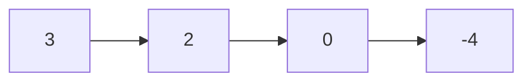
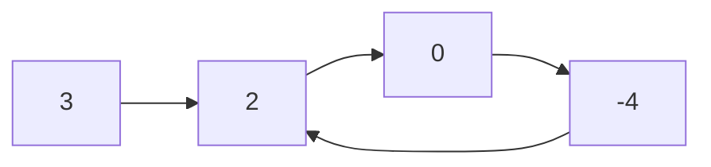
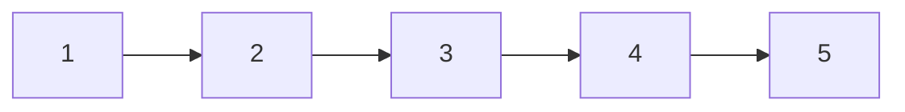
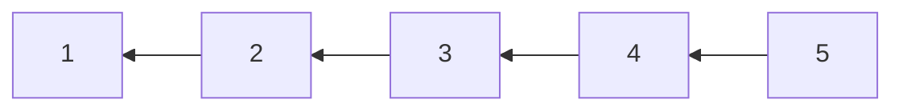

# Linked List

## 21. Merge Two Sorted Lists

=== "Python"

    ```python
    --8<-- "0021_merge_two_sorted_lists.py"
    ```

=== "C++"

    ```cpp
    --8<-- "cpp/0021_merge_two_sorted_lists.cc"
    ```

=== "TypeScript"

    ```typescript
    --8<-- "ts/0021_merge_two_sorted_lists.ts"
    ```

## 141. Linked List Cycle

-   Determine if a linked list has a cycle in it.





=== "Python"

    ```python
    --8<-- "0141_linked_list_cycle.py"
    ```

=== "C++"

    ```cpp
    --8<-- "cpp/0141_linked_list_cycle.cc"
    ```

=== "TypeScript"

    ```typescript
    --8<-- "ts/0141_linked_list_cycle.ts"
    ```

## 206. Reverse Linked List

-   Reverse a singly linked list.





=== "Python"

    ```python
    --8<-- "0206_reverse_linked_list.py"
    ```

=== "C++"

    ```cpp
    --8<-- "cpp/0206_reverse_linked_list.cc"
    ```

=== "TypeScript"

    ```typescript
    --8<-- "ts/0206_reverse_linked_list.ts"
    ```

## 146. Lru Cache

=== "Python"

    ```python
    --8<-- "0146_lru_cache.py"
    ```

=== "C++"

    ```cpp
    --8<-- "cpp/0146_lru_cache.cc"
    ```

=== "TypeScript"

    ```typescript
    --8<-- "ts/0146_lru_cache.ts"
    ```
