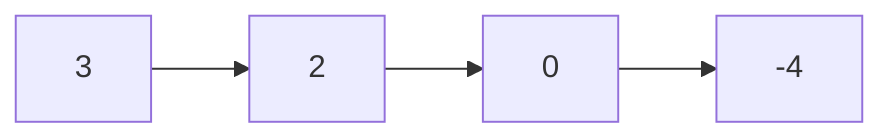
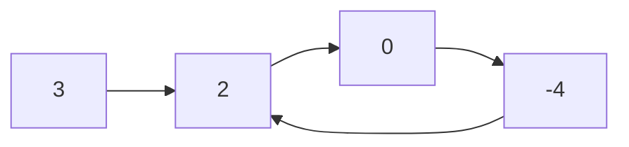

# Linked List

## 21. Merge Two Sorted Lists

-   [LeetCode](https://leetcode.com/problems/merge-two-sorted-lists/) | [LeetCode CH](https://leetcode.cn/problems/merge-two-sorted-lists/) (Easy)

```python
--8<-- "0021_merge_two_sorted_lists.py"
```

## 141. Linked List Cycle

-   [LeetCode](https://leetcode.com/problems/linked-list-cycle/) | [LeetCode CH](https://leetcode.cn/problems/linked-list-cycle/) (Easy)
-   Determine if a linked list has a cycle in it.





```python
--8<-- "0141_linked_list_cycle.py"
```

## 206. Reverse Linked List

-   [LeetCode](https://leetcode.com/problems/reverse-linked-list/) | [LeetCode CH](https://leetcode.cn/problems/reverse-linked-list/) (Easy)
-   Reverse a singly linked list.


```python
--8<-- "0206_reverse_linked_list.py"
```

## 876. Middle of the Linked List

-   [LeetCode](https://leetcode.com/problems/middle-of-the-linked-list/) | [LeetCode CH](https://leetcode.cn/problems/middle-of-the-linked-list/) (Easy)
```python
--8<-- "0876_middle_of_the_linked_list.py"
```

## 146. LRU Cache

-   [LeetCode](https://leetcode.com/problems/lru-cache/) | [LeetCode CH](https://leetcode.cn/problems/lru-cache/) (Medium)
-   Design and implement a data structure for **Least Recently Used (LRU) cache**. It should support the following operations: get and put.

{width=300px}

-   Data structure
    -   Doubly Linked List: to store the key-value pairs.
    -   Hash Map: to store the key-node pairs.

```python
--8<-- "0146_lru_cache.py"
```
