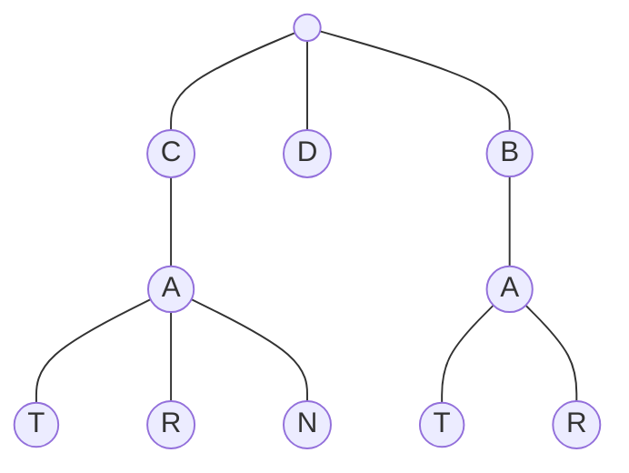

# Trie

## 208. Implement Trie (Prefix Tree)

-  [LeetCode](https://leetcode.com/problems/implement-trie-prefix-tree/) | [LeetCode CH](https://leetcode.cn/problems/implement-trie-prefix-tree/) (Medium)

## Trie

-   A trie is a tree-like data structure whose nodes store the letters of an alphabet.



=== "Python"

    ```python
    --8<-- "0208_implement_trie_prefix_tree.py"
    ```

=== "C++"

    ```cpp
    --8<-- "cpp/0208_implement_trie_prefix_tree.cc"
    ```

=== "TypeScript"

    ```typescript
    --8<-- "ts/0208_implement_trie_prefix_tree.ts"
    ```

## 139. Word Break

-  [LeetCode](https://leetcode.com/problems/word-break/) | [LeetCode CH](https://leetcode.cn/problems/word-break/) (Medium)

=== "Python"

    ```python
    --8<-- "0139_word_break.py"
    ```

=== "C++"

    ```cpp
    --8<-- "cpp/0139_word_break.cc"
    ```

=== "TypeScript"

    ```typescript
    --8<-- "ts/0139_word_break.ts"
    ```
