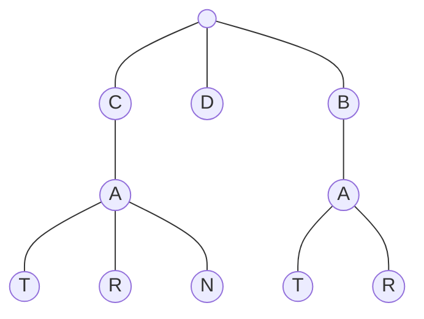

# Trie

- [x] [208. Implement Trie (Prefix Tree)](https://leetcode.cn/problems/implement-trie-prefix-tree/) (Medium)
- [x] [139. Word Break](https://leetcode.cn/problems/word-break/) (Medium)

## 208. Implement Trie (Prefix Tree)

-   [LeetCode](https://leetcode.com/problems/implement-trie-prefix-tree/) | [LeetCode CH](https://leetcode.cn/problems/implement-trie-prefix-tree/) (Medium)

-   Tags: hash table, string, design, trie
## Trie

-   A trie is a tree-like data structure whose nodes store the letters of an alphabet.



```python title="208. Implement Trie (Prefix Tree) - Python Solution"
--8<-- "0208_implement_trie_prefix_tree.py"
```

## 139. Word Break

-   [LeetCode](https://leetcode.com/problems/word-break/) | [LeetCode CH](https://leetcode.cn/problems/word-break/) (Medium)

-   Tags: array, hash table, string, dynamic programming, trie, memoization

```python title="139. Word Break - Python Solution"
--8<-- "0139_word_break.py"
```
