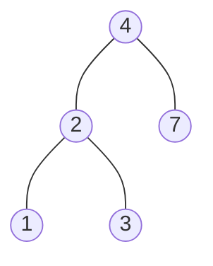

# BST

## 700. Search in a Binary Search Tree

### Binary Search Tree

1. Binary Tree
2. Left subtree of a node contains only nodes with keys less than the node's key
3. Right subtree of a node contains only nodes with keys greater than the node's key
4. The left and right subtree each must also be a binary search tree
5. There must be no duplicate nodes
6. Inorder traversal of a BST gives a sorted list of keys



=== "Python"

    ```python
    --8<-- "0700_search_in_a_binary_search_tree.py"
    ```

=== "C++"

    ```cpp
    --8<-- "cpp/0700_search_in_a_binary_search_tree.cc"
    ```

=== "TypeScript"

    ```typescript
    --8<-- "ts/0700_search_in_a_binary_search_tree.ts"
    ```

## 98. Validate Binary Search Tree

=== "Python"

    ```python
    --8<-- "0098_validate_binary_search_tree.py"
    ```

=== "C++"

    ```cpp
    --8<-- "cpp/0098_validate_binary_search_tree.cc"
    ```

=== "TypeScript"

    ```typescript
    --8<-- "ts/0098_validate_binary_search_tree.ts"
    ```

## 530. Minimum Absolute Difference in BST

=== "Python"

    ```python
    --8<-- "0530_minimum_absolute_difference_in_bst.py"
    ```

=== "C++"

    ```cpp
    --8<-- "cpp/0530_minimum_absolute_difference_in_bst.cc"
    ```

=== "TypeScript"

    ```typescript
    --8<-- "ts/0530_minimum_absolute_difference_in_bst.ts"
    ```

## 501. Find Mode in Binary Search Tree

=== "Python"

    ```python
    --8<-- "0501_find_mode_in_binary_search_tree.py"
    ```

=== "C++"

    ```cpp
    --8<-- "cpp/0501_find_mode_in_binary_search_tree.cc"
    ```

=== "TypeScript"

    ```typescript
    --8<-- "ts/0501_find_mode_in_binary_search_tree.ts"
    ```

## 235. Lowest Common Ancestor of a Binary Search Tree

=== "Python"

    ```python
    --8<-- "0235_lowest_common_ancestor_of_a_binary_search_tree.py"
    ```

=== "C++"

    ```cpp
    --8<-- "cpp/0235_lowest_common_ancestor_of_a_binary_search_tree.cc"
    ```

=== "TypeScript"

    ```typescript
    --8<-- "ts/0235_lowest_common_ancestor_of_a_binary_search_tree.ts"
    ```

## 701. Insert into a Binary Search Tree

=== "Python"

    ```python
    --8<-- "0701_insert_into_a_binary_search_tree.py"
    ```

=== "C++"

    ```cpp
    --8<-- "cpp/0701_insert_into_a_binary_search_tree.cc"
    ```

=== "TypeScript"

    ```typescript
    --8<-- "ts/0701_insert_into_a_binary_search_tree.ts"
    ```

## 450. Delete Node in a BST

=== "Python"

    ```python
    --8<-- "0450_delete_node_in_a_bst.py"
    ```

=== "C++"

    ```cpp
    --8<-- "cpp/0450_delete_node_in_a_bst.cc"
    ```

=== "TypeScript"

    ```typescript
    --8<-- "ts/0450_delete_node_in_a_bst.ts"
    ```

## 669. Trim a Binary Search Tree

=== "Python"

    ```python
    --8<-- "0669_trim_a_binary_search_tree.py"
    ```

=== "C++"

    ```cpp
    --8<-- "cpp/0669_trim_a_binary_search_tree.cc"
    ```

=== "TypeScript"

    ```typescript
    --8<-- "ts/0669_trim_a_binary_search_tree.ts"
    ```

## 108. Convert Sorted Array to Binary Search Tree

=== "Python"

    ```python
    --8<-- "0108_convert_sorted_array_to_binary_search_tree.py"
    ```

=== "C++"

    ```cpp
    --8<-- "cpp/0108_convert_sorted_array_to_binary_search_tree.cc"
    ```

=== "TypeScript"

    ```typescript
    --8<-- "ts/0108_convert_sorted_array_to_binary_search_tree.ts"
    ```

## 109. Convert Sorted List to Binary Search Tree


=== "Python"

    ```python
    --8<-- "0109_convert_sorted_list_to_binary_search_tree.py"
    ```

=== "C++"

    ```cpp
    --8<-- "cpp/0109_convert_sorted_list_to_binary_search_tree.cc"
    ```

=== "TypeScript"

    ```typescript
    --8<-- "ts/0109_convert_sorted_list_to_binary_search_tree.ts"
    ```

## 538. Convert BST to Greater Tree


=== "Python"

    ```python
    --8<-- "0538_convert_bst_to_greater_tree.py"
    ```

=== "C++"

    ```cpp
    --8<-- "cpp/0538_convert_bst_to_greater_tree.cc"
    ```

=== "TypeScript"

    ```typescript
    --8<-- "ts/0538_convert_bst_to_greater_tree.ts"
    ```

## 230. Kth Smallest Element in a BST

=== "Python"

    ```python
    --8<-- "0230_kth_smallest_element_in_a_bst.py"
    ```

=== "C++"

    ```cpp
    --8<-- "cpp/0230_kth_smallest_element_in_a_bst.cc"
    ```

=== "TypeScript"

    ```typescript
    --8<-- "ts/0230_kth_smallest_element_in_a_bst.ts"
    ```

## 173. Binary Search Tree Iterator

=== "Python"

    ```python
    --8<-- "0173_binary_search_tree_iterator.py"
    ```

=== "C++"

    ```cpp
    --8<-- "cpp/0173_binary_search_tree_iterator.cc"
    ```

=== "TypeScript"

    ```typescript
    --8<-- "ts/0173_binary_search_tree_iterator.ts"
    ```

## 1586. Binary Search Tree Iterator II

=== "Python"

    ```python
    --8<-- "1586_binary_search_tree_iterator_ii.py"
    ```

=== "C++"

    ```cpp
    --8<-- "cpp/1586_binary_search_tree_iterator_ii.cc"
    ```

=== "TypeScript"

    ```typescript
    --8<-- "ts/1586_binary_search_tree_iterator_ii.ts"
    ```
