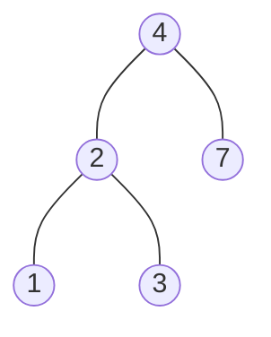

# BST

- [x] [700. Search in a Binary Search Tree](https://leetcode.cn/problems/search-in-a-binary-search-tree/) (Easy)
- [x] [98. Validate Binary Search Tree](https://leetcode.cn/problems/validate-binary-search-tree/) (Medium)
- [x] [530. Minimum Absolute Difference in BST](https://leetcode.cn/problems/minimum-absolute-difference-in-bst/) (Easy)
- [x] [501. Find Mode in Binary Search Tree](https://leetcode.cn/problems/find-mode-in-binary-search-tree/) (Easy)
- [x] [235. Lowest Common Ancestor of a Binary Search Tree](https://leetcode.cn/problems/lowest-common-ancestor-of-a-binary-search-tree/) (Medium)
- [x] [701. Insert into a Binary Search Tree](https://leetcode.cn/problems/insert-into-a-binary-search-tree/) (Medium)
- [x] [450. Delete Node in a BST](https://leetcode.cn/problems/delete-node-in-a-bst/) (Medium)
- [x] [669. Trim a Binary Search Tree](https://leetcode.cn/problems/trim-a-binary-search-tree/) (Medium)
- [x] [108. Convert Sorted Array to Binary Search Tree](https://leetcode.cn/problems/convert-sorted-array-to-binary-search-tree/) (Easy)
- [x] [109. Convert Sorted List to Binary Search Tree](https://leetcode.cn/problems/convert-sorted-list-to-binary-search-tree/) (Medium)
- [x] [538. Convert BST to Greater Tree](https://leetcode.cn/problems/convert-bst-to-greater-tree/) (Medium)
- [x] [230. Kth Smallest Element in a BST](https://leetcode.cn/problems/kth-smallest-element-in-a-bst/) (Medium)
- [x] [173. Binary Search Tree Iterator](https://leetcode.cn/problems/binary-search-tree-iterator/) (Medium)
- [x] [1586. Binary Search Tree Iterator II](https://leetcode.cn/problems/binary-search-tree-iterator-ii/) (Medium) 👑

## 700. Search in a Binary Search Tree

-   [LeetCode](https://leetcode.com/problems/search-in-a-binary-search-tree/) | [LeetCode CH](https://leetcode.cn/problems/search-in-a-binary-search-tree/) (Easy)

-   Tags: tree, binary search tree, binary tree
### Binary Search Tree

1. Binary Tree
2. Left subtree of a node contains only nodes with keys less than the node's key
3. Right subtree of a node contains only nodes with keys greater than the node's key
4. The left and right subtree each must also be a binary search tree
5. There must be no duplicate nodes
6. Inorder traversal of a BST gives a sorted list of keys



```python title="700. Search in a Binary Search Tree - Python Solution"
--8<-- "0700_search_in_a_binary_search_tree.py"
```

## 98. Validate Binary Search Tree

-   [LeetCode](https://leetcode.com/problems/validate-binary-search-tree/) | [LeetCode CH](https://leetcode.cn/problems/validate-binary-search-tree/) (Medium)

-   Tags: tree, depth first search, binary search tree, binary tree

```python title="98. Validate Binary Search Tree - Python Solution"
--8<-- "0098_validate_binary_search_tree.py"
```

```cpp title="98. Validate Binary Search Tree - C++ Solution"
--8<-- "cpp/0098_validate_binary_search_tree.cc"
```

## 530. Minimum Absolute Difference in BST

-   [LeetCode](https://leetcode.com/problems/minimum-absolute-difference-in-bst/) | [LeetCode CH](https://leetcode.cn/problems/minimum-absolute-difference-in-bst/) (Easy)

-   Tags: tree, depth first search, breadth first search, binary search tree, binary tree

```python title="530. Minimum Absolute Difference in BST - Python Solution"
--8<-- "0530_minimum_absolute_difference_in_bst.py"
```

## 501. Find Mode in Binary Search Tree

-   [LeetCode](https://leetcode.com/problems/find-mode-in-binary-search-tree/) | [LeetCode CH](https://leetcode.cn/problems/find-mode-in-binary-search-tree/) (Easy)

-   Tags: tree, depth first search, binary search tree, binary tree

```python title="501. Find Mode in Binary Search Tree - Python Solution"
--8<-- "0501_find_mode_in_binary_search_tree.py"
```

## 235. Lowest Common Ancestor of a Binary Search Tree

-   [LeetCode](https://leetcode.com/problems/lowest-common-ancestor-of-a-binary-search-tree/) | [LeetCode CH](https://leetcode.cn/problems/lowest-common-ancestor-of-a-binary-search-tree/) (Medium)

-   Tags: tree, depth first search, binary search tree, binary tree

```python title="235. Lowest Common Ancestor of a Binary Search Tree - Python Solution"
--8<-- "0235_lowest_common_ancestor_of_a_binary_search_tree.py"
```

## 701. Insert into a Binary Search Tree

-   [LeetCode](https://leetcode.com/problems/insert-into-a-binary-search-tree/) | [LeetCode CH](https://leetcode.cn/problems/insert-into-a-binary-search-tree/) (Medium)

-   Tags: tree, binary search tree, binary tree

```python title="701. Insert into a Binary Search Tree - Python Solution"
--8<-- "0701_insert_into_a_binary_search_tree.py"
```

## 450. Delete Node in a BST

-   [LeetCode](https://leetcode.com/problems/delete-node-in-a-bst/) | [LeetCode CH](https://leetcode.cn/problems/delete-node-in-a-bst/) (Medium)

-   Tags: tree, binary search tree, binary tree

```python title="450. Delete Node in a BST - Python Solution"
--8<-- "0450_delete_node_in_a_bst.py"
```

## 669. Trim a Binary Search Tree

-   [LeetCode](https://leetcode.com/problems/trim-a-binary-search-tree/) | [LeetCode CH](https://leetcode.cn/problems/trim-a-binary-search-tree/) (Medium)

-   Tags: tree, depth first search, binary search tree, binary tree

```python title="669. Trim a Binary Search Tree - Python Solution"
--8<-- "0669_trim_a_binary_search_tree.py"
```

## 108. Convert Sorted Array to Binary Search Tree

-   [LeetCode](https://leetcode.com/problems/convert-sorted-array-to-binary-search-tree/) | [LeetCode CH](https://leetcode.cn/problems/convert-sorted-array-to-binary-search-tree/) (Easy)

-   Tags: array, divide and conquer, tree, binary search tree, binary tree

```python title="108. Convert Sorted Array to Binary Search Tree - Python Solution"
--8<-- "0108_convert_sorted_array_to_binary_search_tree.py"
```

```cpp title="108. Convert Sorted Array to Binary Search Tree - C++ Solution"
--8<-- "cpp/0108_convert_sorted_array_to_binary_search_tree.cc"
```

## 109. Convert Sorted List to Binary Search Tree

-   [LeetCode](https://leetcode.com/problems/convert-sorted-list-to-binary-search-tree/) | [LeetCode CH](https://leetcode.cn/problems/convert-sorted-list-to-binary-search-tree/) (Medium)

-   Tags: linked list, divide and conquer, tree, binary search tree, binary tree


```python title="109. Convert Sorted List to Binary Search Tree - Python Solution"
--8<-- "0109_convert_sorted_list_to_binary_search_tree.py"
```

## 538. Convert BST to Greater Tree

-   [LeetCode](https://leetcode.com/problems/convert-bst-to-greater-tree/) | [LeetCode CH](https://leetcode.cn/problems/convert-bst-to-greater-tree/) (Medium)

-   Tags: tree, depth first search, binary search tree, binary tree


```python title="538. Convert BST to Greater Tree - Python Solution"
--8<-- "0538_convert_bst_to_greater_tree.py"
```

## 230. Kth Smallest Element in a BST

-   [LeetCode](https://leetcode.com/problems/kth-smallest-element-in-a-bst/) | [LeetCode CH](https://leetcode.cn/problems/kth-smallest-element-in-a-bst/) (Medium)

-   Tags: tree, depth first search, binary search tree, binary tree

```python title="230. Kth Smallest Element in a BST - Python Solution"
--8<-- "0230_kth_smallest_element_in_a_bst.py"
```

## 173. Binary Search Tree Iterator

-   [LeetCode](https://leetcode.com/problems/binary-search-tree-iterator/) | [LeetCode CH](https://leetcode.cn/problems/binary-search-tree-iterator/) (Medium)

-   Tags: stack, tree, design, binary search tree, binary tree, iterator

```python title="173. Binary Search Tree Iterator - Python Solution"
--8<-- "0173_binary_search_tree_iterator.py"
```

## 1586. Binary Search Tree Iterator II

-   [LeetCode](https://leetcode.com/problems/binary-search-tree-iterator-ii/) | [LeetCode CH](https://leetcode.cn/problems/binary-search-tree-iterator-ii/) (Medium)

-   Tags: stack, tree, design, binary search tree, binary tree, iterator

```python title="1586. Binary Search Tree Iterator II - Python Solution"
--8<-- "1586_binary_search_tree_iterator_ii.py"
```
