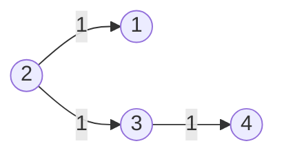
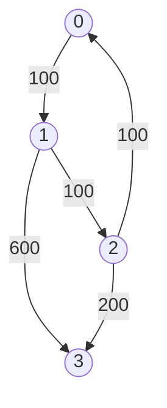

# Graph Bellman Ford

## 743. Network Delay Time

-   Return the minimum time taken to reach all nodes in a network.



-   Shortest Path Problem: Find the shortest path between two vertices in a graph.
-   Dijkstra's Algorithm
    -   Shortest path algorithm
    -   Weighted graph (non-negative weights)
    -   Data Structure: Heap; Hash Set
    -   Time Complexity: O(E \* logV)
    -   Space Complexity: O(V)

=== "Python"

    ```python
    --8<-- "0743_network_delay_time.py"
    ```

=== "C++"

    ```cpp
    --8<-- "cpp/0743_network_delay_time.cc"
    ```

=== "TypeScript"

    ```typescript
    --8<-- "ts/0743_network_delay_time.ts"
    ```

## 787. Cheapest Flights Within K Stops

-   Return the cheapest price from `src` to `dst` with at most `K` stops.



<iframe width="560" height="315" src="https://www.youtube.com/embed/5eIK3zUdYmE?si=aBR0VbHXTgNuVlGz" title="YouTube video player" frameborder="0" allow="accelerometer; autoplay; clipboard-write; encrypted-media; gyroscope; picture-in-picture; web-share" referrerpolicy="strict-origin-when-cross-origin" allowfullscreen></iframe>

=== "Python"

    ```python
    --8<-- "0787_cheapest_flights_within_k_stops.py"
    ```

=== "C++"

    ```cpp
    --8<-- "cpp/0787_cheapest_flights_within_k_stops.cc"
    ```

=== "TypeScript"

    ```typescript
    --8<-- "ts/0787_cheapest_flights_within_k_stops.ts"
    ```
