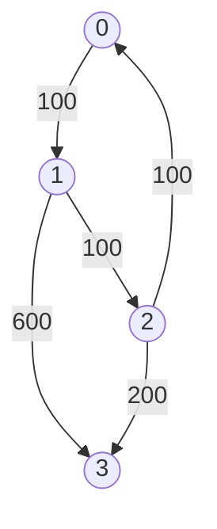

# Graph Bellman Ford

## 743. Network Delay Time

=== "Python"

    ```python
    --8<-- "0743_network_delay_time.py"
    ```

=== "C++"

    ```cpp
    --8<-- "cpp/0743_network_delay_time.cc"
    ```

=== "TypeScript"

    ```typescript
    --8<-- "ts/0743_network_delay_time.ts"
    ```

## 787. Cheapest Flights Within K Stops

-   Return the cheapest price from `src` to `dst` with at most `K` stops.



=== "Python"

    ```python
    --8<-- "0787_cheapest_flights_within_k_stops.py"
    ```

=== "C++"

    ```cpp
    --8<-- "cpp/0787_cheapest_flights_within_k_stops.cc"
    ```

=== "TypeScript"

    ```typescript
    --8<-- "ts/0787_cheapest_flights_within_k_stops.ts"
    ```
