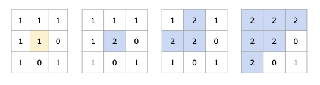

# Graph Flood Fill

## 733. Flood Fill

-   Replace all the pixels of the same color starting from the given pixel.
-   In other words, find the connected component of the starting pixel and change the color of all the pixels in that component.
-   Edge cases: If the starting pixel is already the target color, return the image as it is.
-   **Flood Fill** is essentially a graph traversal algorithm (like BFS or DFS) applied to matrices (2D grids).
    It checks adjacent cells (up, down, left, right) of a starting point to determine whether they belong to the same region.
    Typically, it involves modifying or marking the cells that belong to the same connected component.

{width=300px}



|  1  |   1   |  1  |
| :-: | :---: | :-: |
|  1  | ==1== |  0  |
|  1  |   0   |  1  |

|  1  |   1   |  1  |
| :-: | :---: | :-: |
|  1  | ==2== |  0  |
|  1  |   0   |  1  |

|   1   | ==2== |  1  |
| :---: | :---: | :-: |
| ==2== | ==2== |  0  |
|   1   |   0   |  1  |

| ==2== | ==2== | ==2== |
| :---: | :---: | :---: |
| ==2== | ==2== |   0   |
| ==2== |   0   |   1   |

=== "Python"

    ```python
    --8<-- "0733_flood_fill.py"
    ```

=== "C++"

    ```cpp
    --8<-- "cpp/0733_flood_fill.cc"
    ```

=== "TypeScript"

    ```typescript
    --8<-- "ts/0733_flood_fill.ts"
    ```

## 200. Number of Islands

-   Count the number of islands in a 2D grid.
-   Method 1: DFS
-   Method 2: BFS (use a queue to traverse the grid)

-   How to keep track of visited cells?

    1. Mark the visited cell as `0` (or any other value) to avoid revisiting it.
    2. Use a set to store the visited cells.

-   Steps:
    1. Init: variables
    2. DFS/BFS: starting from the cell with `1`, turn all the connected `1`s to `0`.
    3. Traverse the grid, and if the cell is `1`, increment the count and call DFS/BFS.


=== "Python"

    ```python
    --8<-- "0200_number_of_islands.py"
    ```

=== "C++"

    ```cpp
    --8<-- "cpp/0200_number_of_islands.cc"
    ```

=== "TypeScript"

    ```typescript
    --8<-- "ts/0200_number_of_islands.ts"
    ```

## 695. Max Area of Island

=== "Python"

    ```python
    --8<-- "0695_max_area_of_island.py"
    ```

=== "C++"

    ```cpp
    --8<-- "cpp/0695_max_area_of_island.cc"
    ```

=== "TypeScript"

    ```typescript
    --8<-- "ts/0695_max_area_of_island.ts"
    ```

## 463. Island Perimeter

=== "Python"

    ```python
    --8<-- "0463_island_perimeter.py"
    ```

=== "C++"

    ```cpp
    --8<-- "cpp/0463_island_perimeter.cc"
    ```

=== "TypeScript"

    ```typescript
    --8<-- "ts/0463_island_perimeter.ts"
    ```

## 130. Surrounded Regions

=== "Python"

    ```python
    --8<-- "0130_surrounded_regions.py"
    ```

=== "C++"

    ```cpp
    --8<-- "cpp/0130_surrounded_regions.cc"
    ```

=== "TypeScript"

    ```typescript
    --8<-- "ts/0130_surrounded_regions.ts"
    ```

## 417. Pacific Atlantic Water Flow

=== "Python"

    ```python
    --8<-- "0417_pacific_atlantic_water_flow.py"
    ```

=== "C++"

    ```cpp
    --8<-- "cpp/0417_pacific_atlantic_water_flow.cc"
    ```

=== "TypeScript"

    ```typescript
    --8<-- "ts/0417_pacific_atlantic_water_flow.ts"
    ```

## 827. Making A Large Island

=== "Python"

    ```python
    --8<-- "0827_making_a_large_island.py"
    ```

=== "C++"

    ```cpp
    --8<-- "cpp/0827_making_a_large_island.cc"
    ```

=== "TypeScript"

    ```typescript
    --8<-- "ts/0827_making_a_large_island.ts"
    ```
