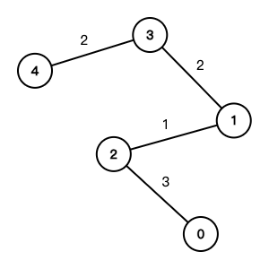

# Graph Minimum Spanning Tree

- [x] [1584. Min Cost to Connect All Points](https://leetcode.cn/problems/min-cost-to-connect-all-points/) (Medium)
- [x] [1135. Connecting Cities With Minimum Cost](https://leetcode.cn/problems/connecting-cities-with-minimum-cost/) (Medium) 👑
- [x] [1168. Optimize Water Distribution in a Village](https://leetcode.cn/problems/optimize-water-distribution-in-a-village/) (Hard) 👑
- [x] [1489. Find Critical and Pseudo-Critical Edges in Minimum Spanning Tree](https://leetcode.cn/problems/find-critical-and-pseudo-critical-edges-in-minimum-spanning-tree/) (Hard)
- [x] [1631. Path With Minimum Effort](https://leetcode.cn/problems/path-with-minimum-effort/) (Medium)
- [x] [1579. Remove Max Number of Edges to Keep Graph Fully Traversable](https://leetcode.cn/problems/remove-max-number-of-edges-to-keep-graph-fully-traversable/) (Hard)

## 1584. Min Cost to Connect All Points

-   [LeetCode](https://leetcode.com/problems/min-cost-to-connect-all-points/) | [LeetCode CH](https://leetcode.cn/problems/min-cost-to-connect-all-points/) (Medium)

-   Tags: array, union find, graph, minimum spanning tree
-   **Tree**: a connected acyclic graph
-   **Spanning Tree**: a subgraph that is a tree and connects all the vertices together
-   **Minimum Spanning Tree (MST)**: a spanning tree with the minimum possible sum of edge weights
-   Prim's Algorithm
    -   Data Structure: Heap
    -   Time Complexity: O(E \* logV)
    -   Space Complexity: O(V + E)
-   Kruskal's Algorithm

    -   Union Find
    -   Time Complexity: O(E \* logV)
    -   Space Complexity: O(V + E)

-   Demonstration

Example graph


MST



```python title="1584. Min Cost to Connect All Points - Python Solution"
--8<-- "1584_min_cost_to_connect_all_points.py"
```

## 1135. Connecting Cities With Minimum Cost

-   [LeetCode](https://leetcode.com/problems/connecting-cities-with-minimum-cost/) | [LeetCode CH](https://leetcode.cn/problems/connecting-cities-with-minimum-cost/) (Medium)

-   Tags: union find, graph, heap priority queue, minimum spanning tree

```python title="1135. Connecting Cities With Minimum Cost - Python Solution"
--8<-- "1135_connecting_cities_with_minimum_cost.py"
```

## 1168. Optimize Water Distribution in a Village

-   [LeetCode](https://leetcode.com/problems/optimize-water-distribution-in-a-village/) | [LeetCode CH](https://leetcode.cn/problems/optimize-water-distribution-in-a-village/) (Hard)

-   Tags: union find, graph, heap priority queue, minimum spanning tree


```python title="1168. Optimize Water Distribution in a Village - Python Solution"
--8<-- "1168_optimize_water_distribution_in_a_village.py"
```

## 1489. Find Critical and Pseudo-Critical Edges in Minimum Spanning Tree

-   [LeetCode](https://leetcode.com/problems/find-critical-and-pseudo-critical-edges-in-minimum-spanning-tree/) | [LeetCode CH](https://leetcode.cn/problems/find-critical-and-pseudo-critical-edges-in-minimum-spanning-tree/) (Hard)

-   Tags: union find, graph, sorting, minimum spanning tree, strongly connected component

```python title="1489. Find Critical and Pseudo-Critical Edges in Minimum Spanning Tree - Python Solution"
--8<-- "1489_find_critical_and_pseudo_critical_edges_in_minimum_spanning_tree.py"
```

## 1631. Path With Minimum Effort

-   [LeetCode](https://leetcode.com/problems/path-with-minimum-effort/) | [LeetCode CH](https://leetcode.cn/problems/path-with-minimum-effort/) (Medium)

-   Tags: array, binary search, depth first search, breadth first search, union find, heap priority queue, matrix
-   Return the minimum effort required to travel from the top-left to the bottom-right corner.

```python title="1631. Path With Minimum Effort - Python Solution"
--8<-- "1631_path_with_minimum_effort.py"
```

## 1579. Remove Max Number of Edges to Keep Graph Fully Traversable

-   [LeetCode](https://leetcode.com/problems/remove-max-number-of-edges-to-keep-graph-fully-traversable/) | [LeetCode CH](https://leetcode.cn/problems/remove-max-number-of-edges-to-keep-graph-fully-traversable/) (Hard)

-   Tags: union find, graph
-   Return the maximum number of edges you can remove so that the graph remains fully traversable.

{width=200px}

```python title="1579. Remove Max Number of Edges to Keep Graph Fully Traversable - Python Solution"
--8<-- "1579_remove_max_number_of_edges_to_keep_graph_fully_traversable.py"
```
