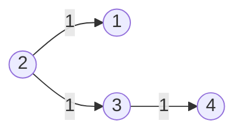
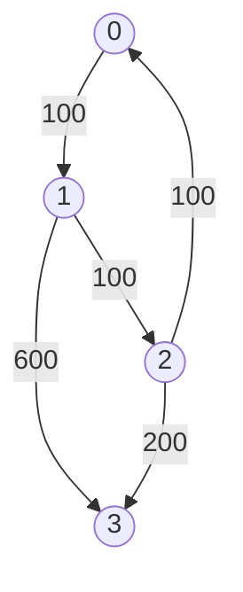

# Graph Shortest Path

## 743. Network Delay Time

-   Return the minimum time taken to reach all nodes in a network.



-   Shortest Path Problem: Find the shortest path between two vertices in a graph.
-   Dijkstra's Algorithm
    -   Shortest path algorithm
    -   Weighted graph (non-negative weights)
    -   Data Structure: Heap; Hash Set
    -   Time Complexity: O(E \* logV)
    -   Space Complexity: O(V)

=== "Python"

    ```python
    --8<-- "0743_network_delay_time.py"
    ```

=== "C++"

    ```cpp
    --8<-- "cpp/0743_network_delay_time.cc"
    ```

=== "TypeScript"

    ```typescript
    --8<-- "ts/0743_network_delay_time.ts"
    ```

## 778. Swim in Rising Water

-   Return the minimum time when you can reach the target.


=== "Python"

    ```python
    --8<-- "0778_swim_in_rising_water.py"
    ```

=== "C++"

    ```cpp
    --8<-- "cpp/0778_swim_in_rising_water.cc"
    ```

=== "TypeScript"

    ```typescript
    --8<-- "ts/0778_swim_in_rising_water.ts"
    ```

## 1631. Path With Minimum Effort

-   Return the minimum effort required to travel from the top-left to the bottom-right corner.

=== "Python"

    ```python
    --8<-- "1631_path_with_minimum_effort.py"
    ```

=== "C++"

    ```cpp
    --8<-- "cpp/1631_path_with_minimum_effort.cc"
    ```

=== "TypeScript"

    ```typescript
    --8<-- "ts/1631_path_with_minimum_effort.ts"
    ```

## 787. Cheapest Flights Within K Stops

-   Return the cheapest price from `src` to `dst` with at most `K` stops.



<iframe width="560" height="315" src="https://www.youtube.com/embed/5eIK3zUdYmE?si=aBR0VbHXTgNuVlGz" title="YouTube video player" frameborder="0" allow="accelerometer; autoplay; clipboard-write; encrypted-media; gyroscope; picture-in-picture; web-share" referrerpolicy="strict-origin-when-cross-origin" allowfullscreen></iframe>

=== "Python"

    ```python
    --8<-- "0787_cheapest_flights_within_k_stops.py"
    ```

=== "C++"

    ```cpp
    --8<-- "cpp/0787_cheapest_flights_within_k_stops.cc"
    ```

=== "TypeScript"

    ```typescript
    --8<-- "ts/0787_cheapest_flights_within_k_stops.ts"
    ```

## 1514. Path with Maximum Probability

=== "Python"

    ```python
    --8<-- "1514_path_with_maximum_probability.py"
    ```

=== "C++"

    ```cpp
    --8<-- "cpp/1514_path_with_maximum_probability.cc"
    ```

=== "TypeScript"

    ```typescript
    --8<-- "ts/1514_path_with_maximum_probability.ts"
    ```

## 505. The Maze II

=== "Python"

    ```python
    --8<-- "0505_the_maze_ii.py"
    ```

=== "C++"

    ```cpp
    --8<-- "cpp/0505_the_maze_ii.cc"
    ```

=== "TypeScript"

    ```typescript
    --8<-- "ts/0505_the_maze_ii.ts"
    ```

## 499. The Maze III

=== "Python"

    ```python
    --8<-- "0499_the_maze_iii.py"
    ```

=== "C++"

    ```cpp
    --8<-- "cpp/0499_the_maze_iii.cc"
    ```

=== "TypeScript"

    ```typescript
    --8<-- "ts/0499_the_maze_iii.ts"
    ```

## 882. Reachable Nodes In Subdivided Graph

=== "Python"

    ```python
    --8<-- "0882_reachable_nodes_in_subdivided_graph.py"
    ```

=== "C++"

    ```cpp
    --8<-- "cpp/0882_reachable_nodes_in_subdivided_graph.cc"
    ```

=== "TypeScript"

    ```typescript
    --8<-- "ts/0882_reachable_nodes_in_subdivided_graph.ts"
    ```

## 1376. Time Needed to Inform All Employees

=== "Python"

    ```python
    --8<-- "1376_time_needed_to_inform_all_employees.py"
    ```

=== "C++"

    ```cpp
    --8<-- "cpp/1376_time_needed_to_inform_all_employees.cc"
    ```

=== "TypeScript"

    ```typescript
    --8<-- "ts/1376_time_needed_to_inform_all_employees.ts"
    ```

## 1168. Optimize Water Distribution in a Village


=== "Python"

    ```python
    --8<-- "1168_optimize_water_distribution_in_a_village.py"
    ```

=== "C++"

    ```cpp
    --8<-- "cpp/1168_optimize_water_distribution_in_a_village.cc"
    ```

=== "TypeScript"

    ```typescript
    --8<-- "ts/1168_optimize_water_distribution_in_a_village.ts"
    ```

## 1976. Number of Ways to Arrive at Destination

=== "Python"

    ```python
    --8<-- "1976_number_of_ways_to_arrive_at_destination.py"
    ```

=== "C++"

    ```cpp
    --8<-- "cpp/1976_number_of_ways_to_arrive_at_destination.cc"
    ```

=== "TypeScript"

    ```typescript
    --8<-- "ts/1976_number_of_ways_to_arrive_at_destination.ts"
    ```
