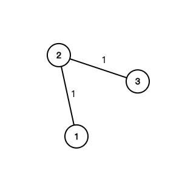
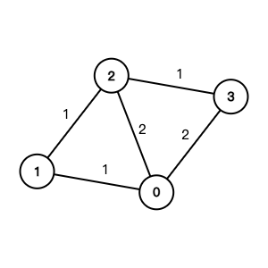

# Graph Shortest Path

## 743. Network Delay Time

-   [LeetCode](https://leetcode.com/problems/network-delay-time/) | [LeetCode CH](https://leetcode.cn/problems/network-delay-time/) (Medium)
-   Tags: depth first search, breadth first search, graph, heap priority queue, shortest path
-   Return the minimum time taken to reach all nodes in a network.


-   Shortest Path Problem: Find the shortest path between two vertices in a graph.
-   Dijkstra's Algorithm
    -   Shortest path algorithm
    -   Weighted graph (non-negative weights)
    -   Data Structure: Heap; Hash Set
    -   Time Complexity: O(E \* logV)
    -   Space Complexity: O(V)

```python
--8<-- "0743_network_delay_time.py"
```

## 778. Swim in Rising Water

-   [LeetCode](https://leetcode.com/problems/swim-in-rising-water/) | [LeetCode CH](https://leetcode.cn/problems/swim-in-rising-water/) (Hard)
-   Tags: array, binary search, depth first search, breadth first search, union find, heap priority queue, matrix
-   Return the minimum time when you can reach the target.


```python
--8<-- "0778_swim_in_rising_water.py"
```

## 1631. Path With Minimum Effort

-   [LeetCode](https://leetcode.com/problems/path-with-minimum-effort/) | [LeetCode CH](https://leetcode.cn/problems/path-with-minimum-effort/) (Medium)
-   Tags: array, binary search, depth first search, breadth first search, union find, heap priority queue, matrix
-   Return the minimum effort required to travel from the top-left to the bottom-right corner.

```python
--8<-- "1631_path_with_minimum_effort.py"
```

## 787. Cheapest Flights Within K Stops

-   [LeetCode](https://leetcode.com/problems/cheapest-flights-within-k-stops/) | [LeetCode CH](https://leetcode.cn/problems/cheapest-flights-within-k-stops/) (Medium)
-   Tags: dynamic programming, depth first search, breadth first search, graph, heap priority queue, shortest path
-   Return the cheapest price from `src` to `dst` with at most `K` stops.


<iframe width="560" height="315" src="https://www.youtube.com/embed/5eIK3zUdYmE?si=aBR0VbHXTgNuVlGz" title="YouTube video player" frameborder="0" allow="accelerometer; autoplay; clipboard-write; encrypted-media; gyroscope; picture-in-picture; web-share" referrerpolicy="strict-origin-when-cross-origin" allowfullscreen></iframe>

```python
--8<-- "0787_cheapest_flights_within_k_stops.py"
```

## 1514. Path with Maximum Probability

-   [LeetCode](https://leetcode.com/problems/path-with-maximum-probability/) | [LeetCode CH](https://leetcode.cn/problems/path-with-maximum-probability/) (Medium)
-   Tags: array, graph, heap priority queue, shortest path

```python
--8<-- "1514_path_with_maximum_probability.py"
```

## 505. The Maze II

-   [LeetCode](https://leetcode.com/problems/the-maze-ii/) | [LeetCode CH](https://leetcode.cn/problems/the-maze-ii/) (Medium)
-   Tags: array, depth first search, breadth first search, graph, heap priority queue, matrix, shortest path

```python
--8<-- "0505_the_maze_ii.py"
```

## 499. The Maze III

-   [LeetCode](https://leetcode.com/problems/the-maze-iii/) | [LeetCode CH](https://leetcode.cn/problems/the-maze-iii/) (Hard)
-   Tags: array, string, depth first search, breadth first search, graph, heap priority queue, matrix, shortest path

```python
--8<-- "0499_the_maze_iii.py"
```

## 882. Reachable Nodes In Subdivided Graph

-   [LeetCode](https://leetcode.com/problems/reachable-nodes-in-subdivided-graph/) | [LeetCode CH](https://leetcode.cn/problems/reachable-nodes-in-subdivided-graph/) (Hard)
-   Tags: graph, heap priority queue, shortest path

```python
--8<-- "0882_reachable_nodes_in_subdivided_graph.py"
```

## 1376. Time Needed to Inform All Employees

-   [LeetCode](https://leetcode.com/problems/time-needed-to-inform-all-employees/) | [LeetCode CH](https://leetcode.cn/problems/time-needed-to-inform-all-employees/) (Medium)
-   Tags: tree, depth first search, breadth first search

```python
--8<-- "1376_time_needed_to_inform_all_employees.py"
```

## 1168. Optimize Water Distribution in a Village

-   [LeetCode](https://leetcode.com/problems/optimize-water-distribution-in-a-village/) | [LeetCode CH](https://leetcode.cn/problems/optimize-water-distribution-in-a-village/) (Hard)
-   Tags: union find, graph, heap priority queue, minimum spanning tree




```python
--8<-- "1168_optimize_water_distribution_in_a_village.py"
```

## 1976. Number of Ways to Arrive at Destination

-   [LeetCode](https://leetcode.com/problems/number-of-ways-to-arrive-at-destination/) | [LeetCode CH](https://leetcode.cn/problems/number-of-ways-to-arrive-at-destination/) (Medium)
-   Tags: dynamic programming, graph, topological sort, shortest path

```python
--8<-- "1976_number_of_ways_to_arrive_at_destination.py"
```
