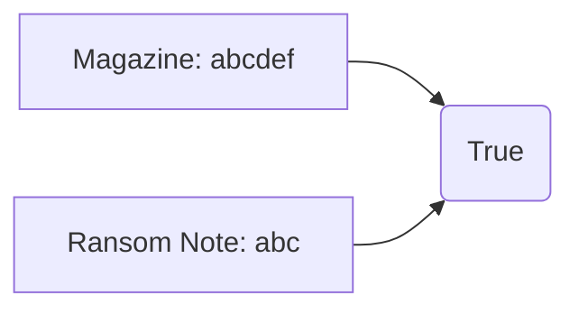

# Hash Map

## 383. Ransom Note

-   [LeetCode](https://leetcode.com/problems/ransom-note/) | [LeetCode CH](https://leetcode.cn/problems/ransom-note/) (Easy)
-   Tags: hash table, string, counting
-   Return `True` if the ransom note can be constructed from the magazines, otherwise, return `False`.



```python
--8<-- "0383_ransom_note.py"
```

## 350. Intersection of Two Arrays II

-   [LeetCode](https://leetcode.com/problems/intersection-of-two-arrays-ii/) | [LeetCode CH](https://leetcode.cn/problems/intersection-of-two-arrays-ii/) (Easy)
-   Tags: array, hash table, two pointers, binary search, sorting
-   Return the intersection of two arrays.

```python
--8<-- "0350_intersection_of_two_arrays_ii.py"
```

## 1. Two Sum

-   [LeetCode](https://leetcode.com/problems/two-sum/) | [LeetCode CH](https://leetcode.cn/problems/two-sum/) (Easy)
-   Tags: array, hash table
-   Return the indices of the two numbers such that they add up to a specific target.

| Approach | Time Complexity | Space Complexity |
| :------: | :-------------: | :--------------: |
| Hashmap  |      O(n)       |       O(n)       |

```python
--8<-- "0001_two_sum.py"
```

## 409. Longest Palindrome

-   [LeetCode](https://leetcode.com/problems/longest-palindrome/) | [LeetCode CH](https://leetcode.cn/problems/longest-palindrome/) (Easy)
-   Tags: hash table, string, greedy
-   Return the length of the longest palindrome that can be built with the characters in the string.

```python
--8<-- "0409_longest_palindrome.py"
```

## 1365. How Many Numbers Are Smaller Than the Current Number

-   [LeetCode](https://leetcode.com/problems/how-many-numbers-are-smaller-than-the-current-number/) | [LeetCode CH](https://leetcode.cn/problems/how-many-numbers-are-smaller-than-the-current-number/) (Easy)
-   Tags: array, hash table, sorting, counting
-   For each number in the array, return how many numbers are smaller than it.

```python
--8<-- "1365_how_many_numbers_are_smaller_than_the_current_number.py"
```

## 202. Happy Number

-   [LeetCode](https://leetcode.com/problems/happy-number/) | [LeetCode CH](https://leetcode.cn/problems/happy-number/) (Easy)
-   Tags: hash table, math, two pointers
-   Return `True` if the number is a happy number, otherwise, return `False`.
-   A happy number is a number defined by the following process: Starting with any positive integer, replace the number by the sum of the squares of its digits, and repeat the process until the number equals 1 (where it will stay), or it loops endlessly in a cycle which does not include 1.

```python
--8<-- "0202_happy_number.py"
```

## 454. 4Sum II

-   [LeetCode](https://leetcode.com/problems/4sum-ii/) | [LeetCode CH](https://leetcode.cn/problems/4sum-ii/) (Medium)
-   Tags: array, hash table
-   Return the number of tuples `(i, j, k, l)` such that `A[i] + B[j] + C[k] + D[l] == 0`.

```python
--8<-- "0454_4sum_ii.py"
```
