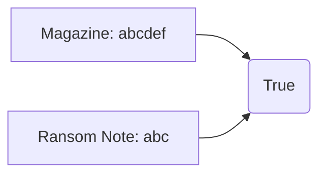

# Hash Map

## 383. Ransom Note

-  [LeetCode](https://leetcode.com/problems/ransom-note/) | [LeetCode CH](https://leetcode.cn/problems/ransom-note/) (Easy)

-   Return `True` if the ransom note can be constructed from the magazines, otherwise, return `False`.



=== "Python"

    ```python
    --8<-- "0383_ransom_note.py"
    ```

=== "C++"

    ```cpp
    --8<-- "cpp/0383_ransom_note.cc"
    ```

=== "TypeScript"

    ```typescript
    --8<-- "ts/0383_ransom_note.ts"
    ```

## 350. Intersection of Two Arrays II

-  [LeetCode](https://leetcode.com/problems/intersection-of-two-arrays-ii/) | [LeetCode CH](https://leetcode.cn/problems/intersection-of-two-arrays-ii/) (Easy)

-   Return the intersection of two arrays.

=== "Python"

    ```python
    --8<-- "0350_intersection_of_two_arrays_ii.py"
    ```

=== "C++"

    ```cpp
    --8<-- "cpp/0350_intersection_of_two_arrays_ii.cc"
    ```

=== "TypeScript"

    ```typescript
    --8<-- "ts/0350_intersection_of_two_arrays_ii.ts"
    ```

## 1. Two Sum

-  [LeetCode](https://leetcode.com/problems/two-sum/) | [LeetCode CH](https://leetcode.cn/problems/two-sum/) (Easy)

-   Return the indices of the two numbers such that they add up to a specific target.

| Approach | Time Complexity | Space Complexity |
| -------- | --------------- | ---------------- |
| Hashmap  | O(n)            | O(n)             |

=== "Python"

    ```python
    --8<-- "0001_two_sum.py"
    ```

=== "C++"

    ```cpp
    --8<-- "cpp/0001_two_sum.cc"
    ```

=== "TypeScript"

    ```typescript
    --8<-- "ts/0001_two_sum.ts"
    ```

## 409. Longest Palindrome

-  [LeetCode](https://leetcode.com/problems/longest-palindrome/) | [LeetCode CH](https://leetcode.cn/problems/longest-palindrome/) (Easy)

-   Return the length of the longest palindrome that can be built with the characters in the string.

=== "Python"

    ```python
    --8<-- "0409_longest_palindrome.py"
    ```

=== "C++"

    ```cpp
    --8<-- "cpp/0409_longest_palindrome.cc"
    ```

=== "TypeScript"

    ```typescript
    --8<-- "ts/0409_longest_palindrome.ts"
    ```

## 1365. How Many Numbers Are Smaller Than the Current Number

-  [LeetCode](https://leetcode.com/problems/how-many-numbers-are-smaller-than-the-current-number/) | [LeetCode CH](https://leetcode.cn/problems/how-many-numbers-are-smaller-than-the-current-number/) (Easy)

-   For each number in the array, return how many numbers are smaller than it.

=== "Python"

    ```python
    --8<-- "1365_how_many_numbers_are_smaller_than_the_current_number.py"
    ```

=== "C++"

    ```cpp
    --8<-- "cpp/1365_how_many_numbers_are_smaller_than_the_current_number.cc"
    ```

=== "TypeScript"

    ```typescript
    --8<-- "ts/1365_how_many_numbers_are_smaller_than_the_current_number.ts"
    ```

## 202. Happy Number

-  [LeetCode](https://leetcode.com/problems/happy-number/) | [LeetCode CH](https://leetcode.cn/problems/happy-number/) (Easy)

-   Return `True` if the number is a happy number, otherwise, return `False`.
-   A happy number is a number defined by the following process: Starting with any positive integer, replace the number by the sum of the squares of its digits, and repeat the process until the number equals 1 (where it will stay), or it loops endlessly in a cycle which does not include 1.

=== "Python"

    ```python
    --8<-- "0202_happy_number.py"
    ```

=== "C++"

    ```cpp
    --8<-- "cpp/0202_happy_number.cc"
    ```

=== "TypeScript"

    ```typescript
    --8<-- "ts/0202_happy_number.ts"
    ```

## 454. 4Sum II

-  [LeetCode](https://leetcode.com/problems/4sum-ii/) | [LeetCode CH](https://leetcode.cn/problems/4sum-ii/) (Medium)

-   Return the number of tuples `(i, j, k, l)` such that `A[i] + B[j] + C[k] + D[l] == 0`.

=== "Python"

    ```python
    --8<-- "0454_4sum_ii.py"
    ```

=== "C++"

    ```cpp
    --8<-- "cpp/0454_4sum_ii.cc"
    ```

=== "TypeScript"

    ```typescript
    --8<-- "ts/0454_4sum_ii.ts"
    ```
