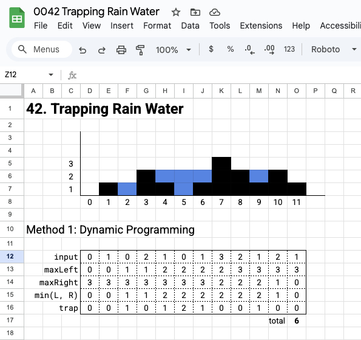

# LeetPattern

### Sheet

-   In order to visualize and practice the algorithm, I use google sheets to make drafts. You also can have access to it [here](https://drive.google.com/drive/folders/1yxoqn6ra6Th5a_KHJRx3drcy950JPRVg?usp=drive_link).

