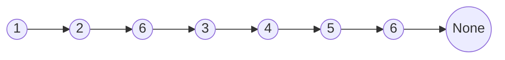
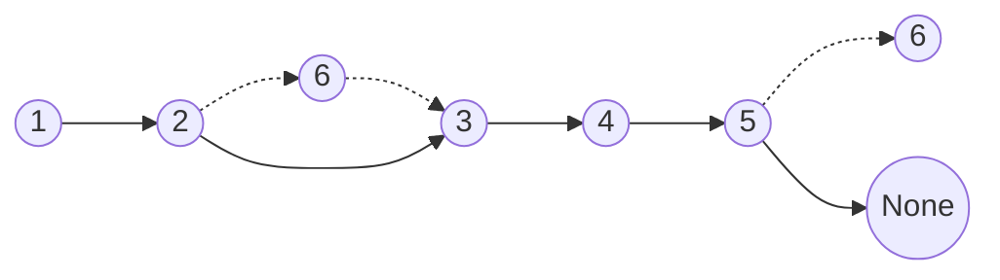
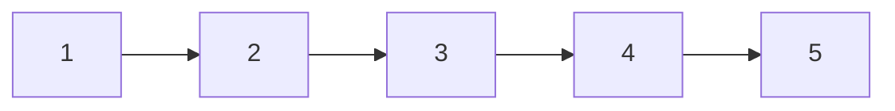
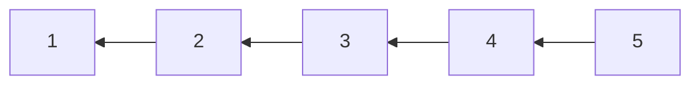
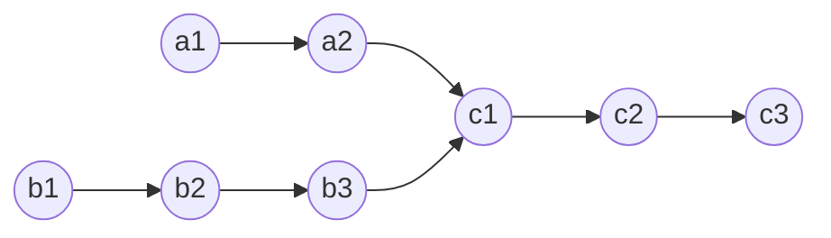
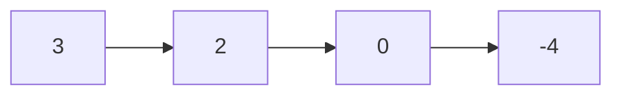
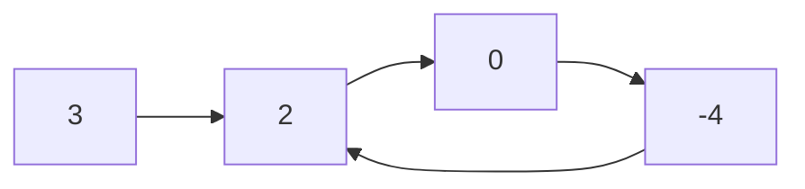

# Linked List

- [x] [203. Remove Linked List Elements](https://leetcode.cn/problems/remove-linked-list-elements/) (Easy)
- [x] [707. Design Linked List](https://leetcode.cn/problems/design-linked-list/) (Medium)
- [x] [206. Reverse Linked List](https://leetcode.cn/problems/reverse-linked-list/) (Easy)
- [x] [237. Delete Node in a Linked List](https://leetcode.cn/problems/delete-node-in-a-linked-list/) (Medium)
- [x] [2487. Remove Nodes From Linked List](https://leetcode.cn/problems/remove-nodes-from-linked-list/) (Medium)
- [x] [24. Swap Nodes in Pairs](https://leetcode.cn/problems/swap-nodes-in-pairs/) (Medium)
- [x] [19. Remove Nth Node From End of List](https://leetcode.cn/problems/remove-nth-node-from-end-of-list/) (Medium)
- [x] [160. Intersection of Two Linked Lists](https://leetcode.cn/problems/intersection-of-two-linked-lists/) (Easy)
- [x] [141. Linked List Cycle](https://leetcode.cn/problems/linked-list-cycle/) (Easy)
- [x] [142. Linked List Cycle II](https://leetcode.cn/problems/linked-list-cycle-ii/) (Medium)
- [x] [2816. Double a Number Represented as a Linked List](https://leetcode.cn/problems/double-a-number-represented-as-a-linked-list/) (Medium)
- [x] [2. Add Two Numbers](https://leetcode.cn/problems/add-two-numbers/) (Medium)

## 203. Remove Linked List Elements

-   [LeetCode](https://leetcode.com/problems/remove-linked-list-elements/) | [LeetCode CH](https://leetcode.cn/problems/remove-linked-list-elements/) (Easy)

-   Tags: linked list, recursion
-   Remove all elements from a linked list of integers that have value `val`.

-   Before



-   After



```python title="203. Remove Linked List Elements - Python Solution"
--8<-- "0203_remove_linked_list_elements.py"
```

## 707. Design Linked List

-   [LeetCode](https://leetcode.com/problems/design-linked-list/) | [LeetCode CH](https://leetcode.cn/problems/design-linked-list/) (Medium)

-   Tags: linked list, design
-   Design your implementation of the linked list. You can choose to use a singly or doubly linked list.

```python title="707. Design Linked List - Python Solution"
--8<-- "0707_design_linked_list.py"
```

## 206. Reverse Linked List

-   [LeetCode](https://leetcode.com/problems/reverse-linked-list/) | [LeetCode CH](https://leetcode.cn/problems/reverse-linked-list/) (Easy)

-   Tags: linked list, recursion
-   Reverse a singly linked list.





```python title="206. Reverse Linked List - Python Solution"
--8<-- "0206_reverse_linked_list.py"
```

## 237. Delete Node in a Linked List

-   [LeetCode](https://leetcode.com/problems/delete-node-in-a-linked-list/) | [LeetCode CH](https://leetcode.cn/problems/delete-node-in-a-linked-list/) (Medium)

-   Tags: linked list
-   Delete a node in a singly linked list. You are given only the node to be deleted.

```python title="237. Delete Node in a Linked List - Python Solution"
--8<-- "0237_delete_node_in_a_linked_list.py"
```

## 2487. Remove Nodes From Linked List

-   [LeetCode](https://leetcode.com/problems/remove-nodes-from-linked-list/) | [LeetCode CH](https://leetcode.cn/problems/remove-nodes-from-linked-list/) (Medium)

-   Tags: linked list, stack, recursion, monotonic stack
-   Remove all nodes from a linked list that have a value greater than `maxValue`.

```python title="2487. Remove Nodes From Linked List - Python Solution"
--8<-- "2487_remove_nodes_from_linked_list.py"
```

## 24. Swap Nodes in Pairs

-   [LeetCode](https://leetcode.com/problems/swap-nodes-in-pairs/) | [LeetCode CH](https://leetcode.cn/problems/swap-nodes-in-pairs/) (Medium)

-   Tags: linked list, recursion
-   Given a linked list, swap every two adjacent nodes and return its head.

```python title="24. Swap Nodes in Pairs - Python Solution"
--8<-- "0024_swap_nodes_in_pairs.py"
```

## 19. Remove Nth Node From End of List

-   [LeetCode](https://leetcode.com/problems/remove-nth-node-from-end-of-list/) | [LeetCode CH](https://leetcode.cn/problems/remove-nth-node-from-end-of-list/) (Medium)

-   Tags: linked list, two pointers
-   Given the `head` of a linked list, remove the `n-th` node from the end of the list and return its head.

```python title="19. Remove Nth Node From End of List - Python Solution"
--8<-- "0019_remove_nth_node_from_end_of_list.py"
```

## 160. Intersection of Two Linked Lists

-   [LeetCode](https://leetcode.com/problems/intersection-of-two-linked-lists/) | [LeetCode CH](https://leetcode.cn/problems/intersection-of-two-linked-lists/) (Easy)

-   Tags: hash table, linked list, two pointers
-   Find the node at which the intersection of two singly linked lists begins.



```python title="160. Intersection of Two Linked Lists - Python Solution"
--8<-- "0160_intersection_of_two_linked_lists.py"
```

## 141. Linked List Cycle

-   [LeetCode](https://leetcode.com/problems/linked-list-cycle/) | [LeetCode CH](https://leetcode.cn/problems/linked-list-cycle/) (Easy)

-   Tags: hash table, linked list, two pointers
-   Determine if a linked list has a cycle in it.





```python title="141. Linked List Cycle - Python Solution"
--8<-- "0141_linked_list_cycle.py"
```

```cpp title="141. Linked List Cycle - C++ Solution"
--8<-- "cpp/0141_linked_list_cycle.cc"
```

## 142. Linked List Cycle II

-   [LeetCode](https://leetcode.com/problems/linked-list-cycle-ii/) | [LeetCode CH](https://leetcode.cn/problems/linked-list-cycle-ii/) (Medium)

-   Tags: hash table, linked list, two pointers
-   Given a linked list, return the node where the cycle begins. If there is no cycle, return `None`.


```python title="142. Linked List Cycle II - Python Solution"
--8<-- "0142_linked_list_cycle_ii.py"
```

```cpp title="142. Linked List Cycle II - C++ Solution"
--8<-- "cpp/0142_linked_list_cycle_ii.cc"
```

## 2816. Double a Number Represented as a Linked List

-   [LeetCode](https://leetcode.com/problems/double-a-number-represented-as-a-linked-list/) | [LeetCode CH](https://leetcode.cn/problems/double-a-number-represented-as-a-linked-list/) (Medium)

-   Tags: linked list, math, stack
-   Given a number represented as a linked list, double it and return the resulting linked list.

```python title="2816. Double a Number Represented as a Linked List - Python Solution"
--8<-- "2816_double_a_number_represented_as_a_linked_list.py"
```

## 2. Add Two Numbers

-   [LeetCode](https://leetcode.com/problems/add-two-numbers/) | [LeetCode CH](https://leetcode.cn/problems/add-two-numbers/) (Medium)

-   Tags: linked list, math, recursion
-   Represent the sum of two numbers as a linked list.

```python title="2. Add Two Numbers - Python Solution"
--8<-- "0002_add_two_numbers.py"
```
