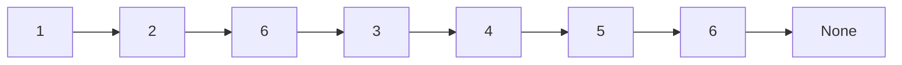
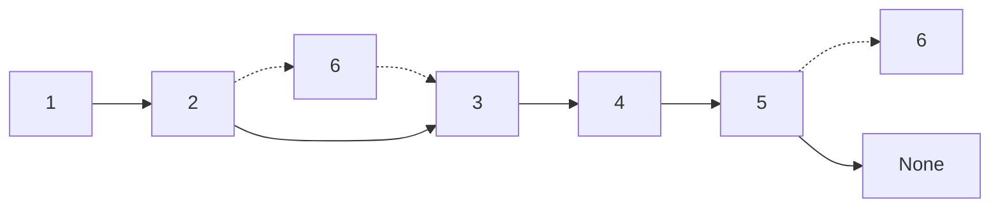
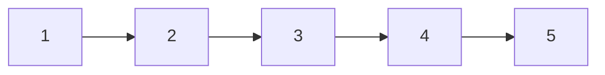
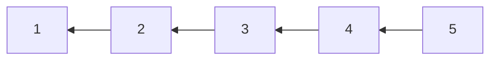
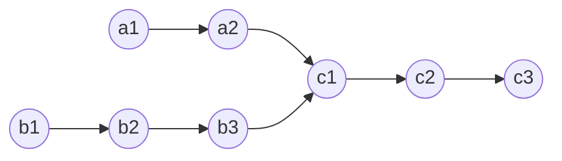
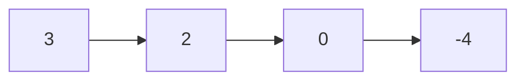
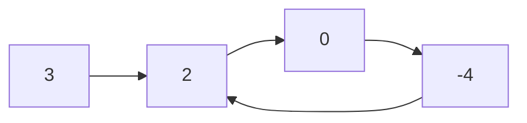

# Linked List

## 203. Remove Linked List Elements

-   Remove all elements from a linked list of integers that have value `val`.

-   Before



-   After



=== "Python"

    ```python
    --8<-- "0203_remove_linked_list_elements.py"
    ```

=== "C++"

    ```cpp
    --8<-- "cpp/0203_remove_linked_list_elements.cc"
    ```

=== "TypeScript"

    ```typescript
    --8<-- "ts/0203_remove_linked_list_elements.ts"
    ```

## 707. Design Linked List

-   Design your implementation of the linked list. You can choose to use a singly or doubly linked list.

=== "Python"

    ```python
    --8<-- "0707_design_linked_list.py"
    ```

=== "C++"

    ```cpp
    --8<-- "cpp/0707_design_linked_list.cc"
    ```

=== "TypeScript"

    ```typescript
    --8<-- "ts/0707_design_linked_list.ts"
    ```

## 206. Reverse Linked List

-   Reverse a singly linked list.





=== "Python"

    ```python
    --8<-- "0206_reverse_linked_list.py"
    ```

=== "C++"

    ```cpp
    --8<-- "cpp/0206_reverse_linked_list.cc"
    ```

=== "TypeScript"

    ```typescript
    --8<-- "ts/0206_reverse_linked_list.ts"
    ```

## 237. Delete Node in a Linked List

-   Delete a node in a singly linked list. You are given only the node to be deleted.

=== "Python"

    ```python
    --8<-- "0237_delete_node_in_a_linked_list.py"
    ```

=== "C++"

    ```cpp
    --8<-- "cpp/0237_delete_node_in_a_linked_list.cc"
    ```

=== "TypeScript"

    ```typescript
    --8<-- "ts/0237_delete_node_in_a_linked_list.ts"
    ```

## 2487. Remove Nodes From Linked List

-   Remove all nodes from a linked list that have a value greater than `maxValue`.

=== "Python"

    ```python
    --8<-- "2487_remove_nodes_from_linked_list.py"
    ```

=== "C++"

    ```cpp
    --8<-- "cpp/2487_remove_nodes_from_linked_list.cc"
    ```

=== "TypeScript"

    ```typescript
    --8<-- "ts/2487_remove_nodes_from_linked_list.ts"
    ```

## 24. Swap Nodes in Pairs

-   Given a linked list, swap every two adjacent nodes and return its head.

=== "Python"

    ```python
    --8<-- "0024_swap_nodes_in_pairs.py"
    ```

=== "C++"

    ```cpp
    --8<-- "cpp/0024_swap_nodes_in_pairs.cc"
    ```

=== "TypeScript"

    ```typescript
    --8<-- "ts/0024_swap_nodes_in_pairs.ts"
    ```

## 19. Remove Nth Node From End of List

-   Given the `head` of a linked list, remove the `n-th` node from the end of the list and return its head.

=== "Python"

    ```python
    --8<-- "0019_remove_nth_node_from_end_of_list.py"
    ```

=== "C++"

    ```cpp
    --8<-- "cpp/0019_remove_nth_node_from_end_of_list.cc"
    ```

=== "TypeScript"

    ```typescript
    --8<-- "ts/0019_remove_nth_node_from_end_of_list.ts"
    ```

## 160. Intersection of Two Linked Lists

-   Find the node at which the intersection of two singly linked lists begins.



=== "Python"

    ```python
    --8<-- "0160_intersection_of_two_linked_lists.py"
    ```

=== "C++"

    ```cpp
    --8<-- "cpp/0160_intersection_of_two_linked_lists.cc"
    ```

=== "TypeScript"

    ```typescript
    --8<-- "ts/0160_intersection_of_two_linked_lists.ts"
    ```

## 141. Linked List Cycle

-   Determine if a linked list has a cycle in it.





=== "Python"

    ```python
    --8<-- "0141_linked_list_cycle.py"
    ```

=== "C++"

    ```cpp
    --8<-- "cpp/0141_linked_list_cycle.cc"
    ```

=== "TypeScript"

    ```typescript
    --8<-- "ts/0141_linked_list_cycle.ts"
    ```

## 142. Linked List Cycle II

-   Given a linked list, return the node where the cycle begins. If there is no cycle, return `None`.


=== "Python"

    ```python
    --8<-- "0142_linked_list_cycle_ii.py"
    ```

=== "C++"

    ```cpp
    --8<-- "cpp/0142_linked_list_cycle_ii.cc"
    ```

=== "TypeScript"

    ```typescript
    --8<-- "ts/0142_linked_list_cycle_ii.ts"
    ```

## 2816. Double a Number Represented as a Linked List

-   Given a number represented as a linked list, double it and return the resulting linked list.

=== "Python"

    ```python
    --8<-- "2816_double_a_number_represented_as_a_linked_list.py"
    ```

=== "C++"

    ```cpp
    --8<-- "cpp/2816_double_a_number_represented_as_a_linked_list.cc"
    ```

=== "TypeScript"

    ```typescript
    --8<-- "ts/2816_double_a_number_represented_as_a_linked_list.ts"
    ```

## 2. Add Two Numbers

-   Represent the sum of two numbers as a linked list.

=== "Python"

    ```python
    --8<-- "0002_add_two_numbers.py"
    ```

=== "C++"

    ```cpp
    --8<-- "cpp/0002_add_two_numbers.cc"
    ```

=== "TypeScript"

    ```typescript
    --8<-- "ts/0002_add_two_numbers.ts"
    ```
