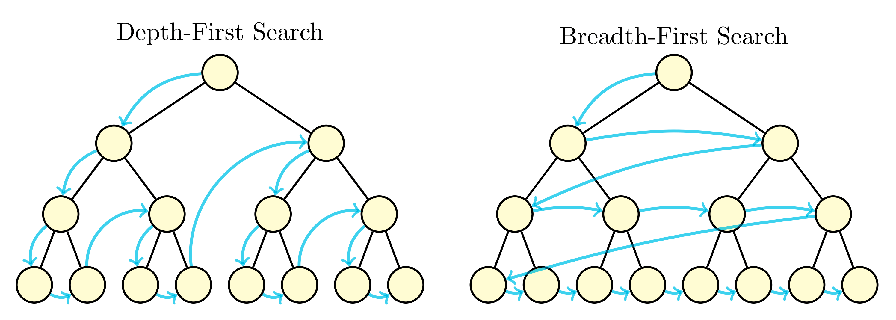
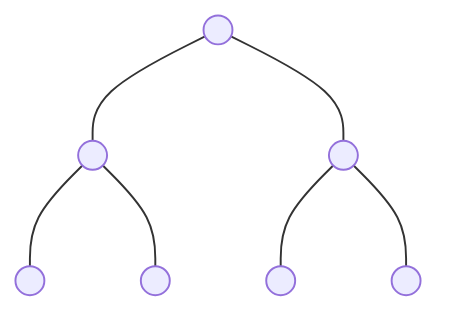
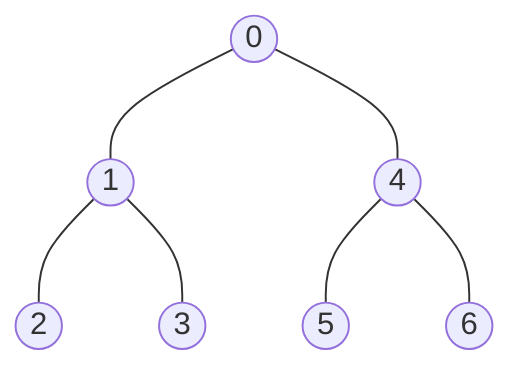
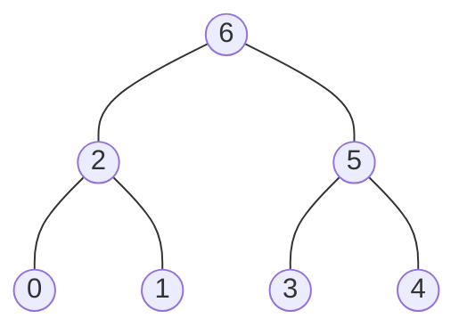
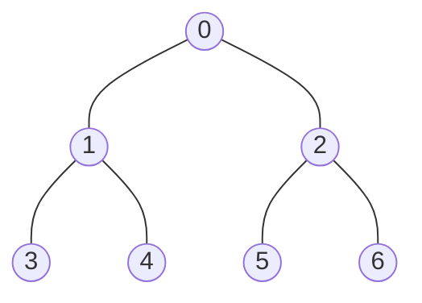

# Tree Traversal

## 144. Binary Tree Preorder Traversal



### Example 1



Pre-order Traversal



In-order Traversal


Post-order Traversal



Level Order Traversal


### Example 2



| Traversal   | Order             | Method         | Result                        |
| ----------- | ----------------- | -------------- | ----------------------------- |
| Preorder    | Root, Left, Right | DFS or Stack   | `[0, 1, 3, 4, 2, 5, 6]`       |
| Inorder     | Left, Root, Right | DFS or Stack   | `[3, 1, 4, 0, 5, 2, 6]`       |
| Postorder   | Left, Right, Root | DFS or Stack   | `[3, 4, 1, 5, 6, 2, 0]`       |
| Level Order | Level by Level    | BFS with Queue | `[[0], [1, 2], [3, 4, 5, 6]]` |

=== "Python"

    ```python
    --8<-- "0144_binary_tree_preorder_traversal.py"
    ```

=== "C++"

    ```cpp
    --8<-- "cpp/0144_binary_tree_preorder_traversal.cc"
    ```

=== "TypeScript"

    ```typescript
    --8<-- "ts/0144_binary_tree_preorder_traversal.ts"
    ```

## 94. Binary Tree Inorder Traversal

=== "Python"

    ```python
    --8<-- "0094_binary_tree_inorder_traversal.py"
    ```

=== "C++"

    ```cpp
    --8<-- "cpp/0094_binary_tree_inorder_traversal.cc"
    ```

=== "TypeScript"

    ```typescript
    --8<-- "ts/0094_binary_tree_inorder_traversal.ts"
    ```

## 145. Binary Tree Postorder Traversal

=== "Python"

    ```python
    --8<-- "0145_binary_tree_postorder_traversal.py"
    ```

=== "C++"

    ```cpp
    --8<-- "cpp/0145_binary_tree_postorder_traversal.cc"
    ```

=== "TypeScript"

    ```typescript
    --8<-- "ts/0145_binary_tree_postorder_traversal.ts"
    ```

## 102. Binary Tree Level Order Traversal

=== "Python"

    ```python
    --8<-- "0102_binary_tree_level_order_traversal.py"
    ```

=== "C++"

    ```cpp
    --8<-- "cpp/0102_binary_tree_level_order_traversal.cc"
    ```

=== "TypeScript"

    ```typescript
    --8<-- "ts/0102_binary_tree_level_order_traversal.ts"
    ```

## 107. Binary Tree Level Order Traversal II

=== "Python"

    ```python
    --8<-- "0107_binary_tree_level_order_traversal_ii.py"
    ```

=== "C++"

    ```cpp
    --8<-- "cpp/0107_binary_tree_level_order_traversal_ii.cc"
    ```

=== "TypeScript"

    ```typescript
    --8<-- "ts/0107_binary_tree_level_order_traversal_ii.ts"
    ```

## 103. Binary Tree Zigzag Level Order Traversal

=== "Python"

    ```python
    --8<-- "0103_binary_tree_zigzag_level_order_traversal.py"
    ```

=== "C++"

    ```cpp
    --8<-- "cpp/0103_binary_tree_zigzag_level_order_traversal.cc"
    ```

=== "TypeScript"

    ```typescript
    --8<-- "ts/0103_binary_tree_zigzag_level_order_traversal.ts"
    ```
