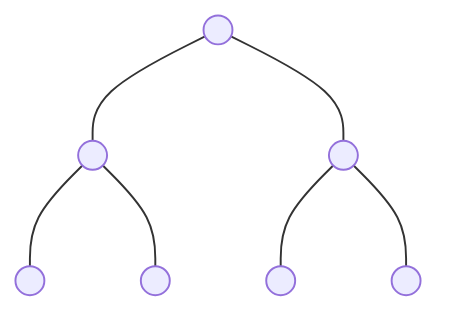
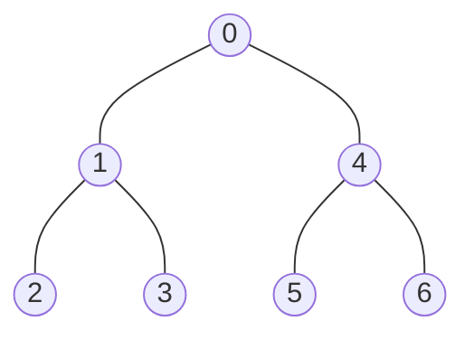
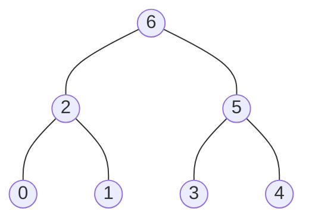
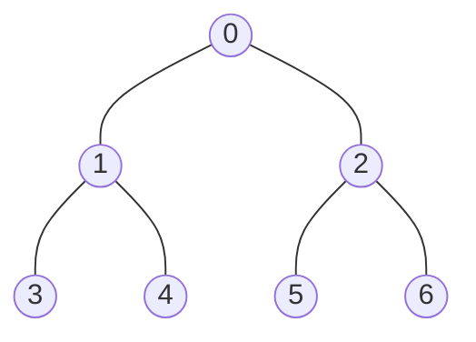

# Tree Traversal

- [x] [144. Binary Tree Preorder Traversal](https://leetcode.cn/problems/binary-tree-preorder-traversal/) (Easy)
- [x] [94. Binary Tree Inorder Traversal](https://leetcode.cn/problems/binary-tree-inorder-traversal/) (Easy)
- [x] [145. Binary Tree Postorder Traversal](https://leetcode.cn/problems/binary-tree-postorder-traversal/) (Easy)
- [x] [102. Binary Tree Level Order Traversal](https://leetcode.cn/problems/binary-tree-level-order-traversal/) (Medium)
- [x] [107. Binary Tree Level Order Traversal II](https://leetcode.cn/problems/binary-tree-level-order-traversal-ii/) (Medium)
- [x] [103. Binary Tree Zigzag Level Order Traversal](https://leetcode.cn/problems/binary-tree-zigzag-level-order-traversal/) (Medium)

## 144. Binary Tree Preorder Traversal

-   [LeetCode](https://leetcode.com/problems/binary-tree-preorder-traversal/) | [LeetCode CH](https://leetcode.cn/problems/binary-tree-preorder-traversal/) (Easy)

-   Tags: stack, tree, depth first search, binary tree


### Example 1



Pre-order Traversal



In-order Traversal


Post-order Traversal



Level Order Traversal


### Example 2



| Traversal   | Order             | Method         | Result                        |
| ----------- | ----------------- | -------------- | ----------------------------- |
| Preorder    | Root, Left, Right | DFS or Stack   | `[0, 1, 3, 4, 2, 5, 6]`       |
| Inorder     | Left, Root, Right | DFS or Stack   | `[3, 1, 4, 0, 5, 2, 6]`       |
| Postorder   | Left, Right, Root | DFS or Stack   | `[3, 4, 1, 5, 6, 2, 0]`       |
| Level Order | Level by Level    | BFS with Queue | `[[0], [1, 2], [3, 4, 5, 6]]` |

```python title="144. Binary Tree Preorder Traversal - Python Solution"
--8<-- "0144_binary_tree_preorder_traversal.py"
```

## 94. Binary Tree Inorder Traversal

-   [LeetCode](https://leetcode.com/problems/binary-tree-inorder-traversal/) | [LeetCode CH](https://leetcode.cn/problems/binary-tree-inorder-traversal/) (Easy)

-   Tags: stack, tree, depth first search, binary tree

```python title="94. Binary Tree Inorder Traversal - Python Solution"
--8<-- "0094_binary_tree_inorder_traversal.py"
```

## 145. Binary Tree Postorder Traversal

-   [LeetCode](https://leetcode.com/problems/binary-tree-postorder-traversal/) | [LeetCode CH](https://leetcode.cn/problems/binary-tree-postorder-traversal/) (Easy)

-   Tags: stack, tree, depth first search, binary tree

```python title="145. Binary Tree Postorder Traversal - Python Solution"
--8<-- "0145_binary_tree_postorder_traversal.py"
```

## 102. Binary Tree Level Order Traversal

-   [LeetCode](https://leetcode.com/problems/binary-tree-level-order-traversal/) | [LeetCode CH](https://leetcode.cn/problems/binary-tree-level-order-traversal/) (Medium)

-   Tags: tree, breadth first search, binary tree

```python title="102. Binary Tree Level Order Traversal - Python Solution"
--8<-- "0102_binary_tree_level_order_traversal.py"
```

## 107. Binary Tree Level Order Traversal II

-   [LeetCode](https://leetcode.com/problems/binary-tree-level-order-traversal-ii/) | [LeetCode CH](https://leetcode.cn/problems/binary-tree-level-order-traversal-ii/) (Medium)

-   Tags: tree, breadth first search, binary tree

```python title="107. Binary Tree Level Order Traversal II - Python Solution"
--8<-- "0107_binary_tree_level_order_traversal_ii.py"
```

## 103. Binary Tree Zigzag Level Order Traversal

-   [LeetCode](https://leetcode.com/problems/binary-tree-zigzag-level-order-traversal/) | [LeetCode CH](https://leetcode.cn/problems/binary-tree-zigzag-level-order-traversal/) (Medium)

-   Tags: tree, breadth first search, binary tree

```python title="103. Binary Tree Zigzag Level Order Traversal - Python Solution"
--8<-- "0103_binary_tree_zigzag_level_order_traversal.py"
```
