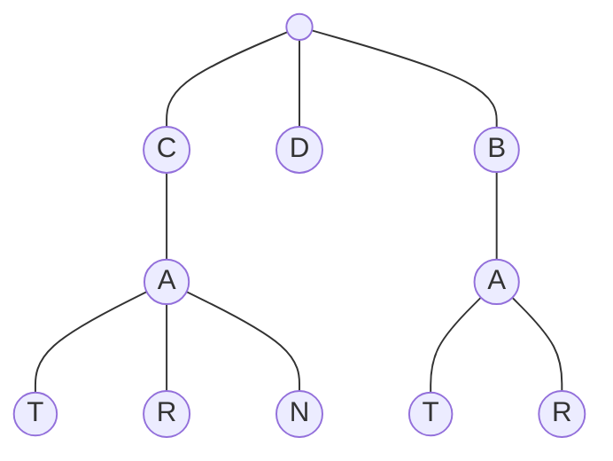

# Trie

## 208. Implement Trie (Prefix Tree)

## Trie

-   A trie is a tree-like data structure whose nodes store the letters of an alphabet.



=== "Python"

    ```python
    --8<-- "0208_implement_trie_prefix_tree.py"
    ```

=== "C++"

    ```cpp
    --8<-- "cpp/0208_implement_trie_prefix_tree.cc"
    ```

=== "TypeScript"

    ```typescript
    --8<-- "ts/0208_implement_trie_prefix_tree.ts"
    ```

## 211. Design Add and Search Words Data Structure

=== "Python"

    ```python
    --8<-- "0211_design_add_and_search_words_data_structure.py"
    ```

=== "C++"

    ```cpp
    --8<-- "cpp/0211_design_add_and_search_words_data_structure.cc"
    ```

=== "TypeScript"

    ```typescript
    --8<-- "ts/0211_design_add_and_search_words_data_structure.ts"
    ```

## 212. Word Search II

=== "Python"

    ```python
    --8<-- "0212_word_search_ii.py"
    ```

=== "C++"

    ```cpp
    --8<-- "cpp/0212_word_search_ii.cc"
    ```

=== "TypeScript"

    ```typescript
    --8<-- "ts/0212_word_search_ii.ts"
    ```
