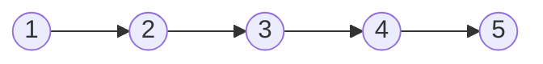
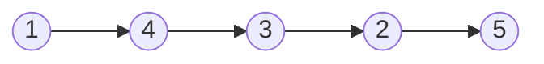

- Reverse a linked list from position left to position right. Return the linked list after reversing.

```mermaid
graph LR
A((1)) --> B((2))
B --> C((3))
C --> D((4))
D --> E((5))
```

```mermaid
graph LR
A((1)) --> B((4))
B --> C((3))
C --> D((2))
D --> E((5))
```
