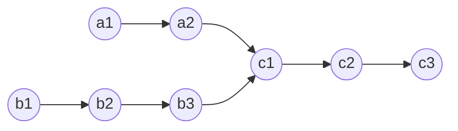

-   Find the node at which the intersection of two singly linked lists begins.

```mermaid
graph LR
a1((a1)) --> a2((a2))
a2 --> c1((c1))
b1((b1)) --> b2((b2))
b2 --> b3((b3))
b3 --> c1
c1 --> c2((c2))
c2 --> c3((c3))
```
