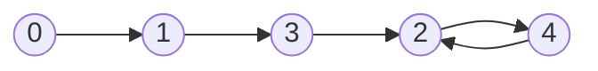

-   Find the duplicate number in an array containing `n + 1` integers where each integer is between `1` and `n` inclusive.
-   Floyd's Tortoise and Hare (Cycle Detection)
    -   141. Linked List Cycle
    -   142. Linked List Cycle II
-   Time Complexity: O(n)
-   Space Complexity: O(1)

Example: `nums = [1, 3, 4, 2, 2]`

|  0   |  1   |  2   |  3   |  4   |
| :--: | :--: | :--: | :--: | :--: |
|  1   |  3   |  4   |  2   |  2   |

